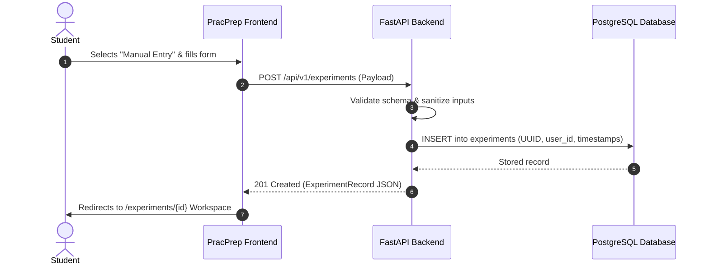
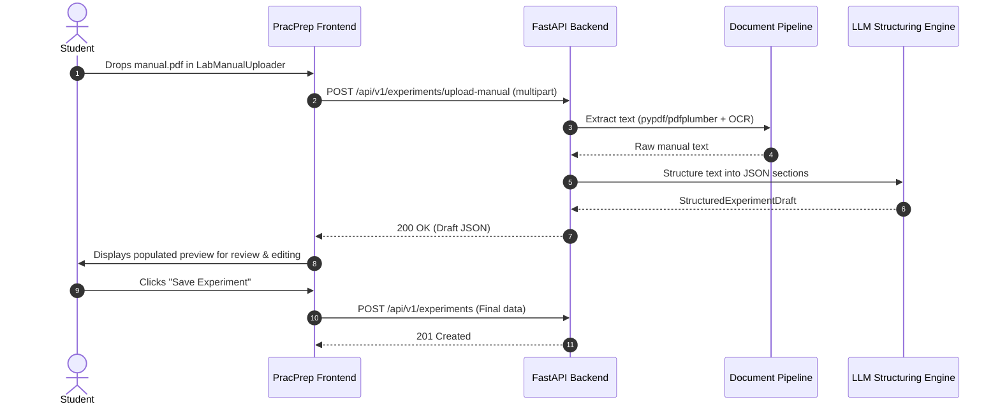
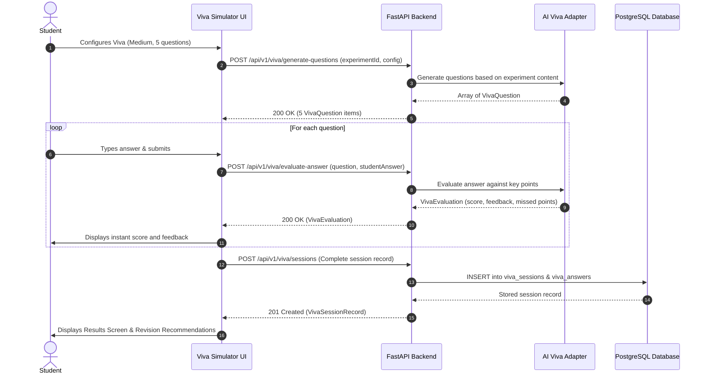

# PracPrep — Product Requirements Document (PRD)

**Product Name:** PracPrep — From Lab Manual to Lab-Ready  
**Document Version:** 1.0.0  
**Date:** 2026-10-04  
**Author:** Senior Software Architect, Backend Engineer & Technical Lead  
**Status:** Approved Requirements Specification  

---

## 1. Product Vision & Problem Statement

### 1.1 The Problem
In undergraduate engineering education, laboratory practicals and oral viva-voce examinations constitute a significant portion of academic evaluation. However, students face critical hurdles:
1. **Unstructured Laboratory Manuals:** Lab manuals are traditionally distributed as static, multi-page PDFs, photocopied booklets, or scanned sheets. Key theoretical concepts, apparatus principles, formulas, and safety precautions are fragmented and difficult to study.
2. **Viva-Voce Anxiety & Lack of Practice:** Students rarely have opportunities to practice oral viva questions before entering the lab. They enter practical exams unsure of what will be asked or how their conceptual explanations will be evaluated.
3. **No Feedback Loop:** Traditional preparation is passive reading. Students cannot assess whether their explanations hit key conceptual benchmarks.
4. **Scattered Preparation Data:** Checklists, experiment notes, past viva attempts, and revision priorities are lost across devices or paper sheets.

### 1.2 The Product Vision
**PracPrep** transforms passive lab manuals into an active, intelligent laboratory preparation companion. 

By pairing an automated document extraction pipeline with a structured workspace, an AI-powered viva simulator, and continuous progress analytics, PracPrep ensures engineering students walk into every lab session **confident, prepared, and lab-ready**.

---

## 2. Target Users & Personas

### Persona A: The Stressed Engineering Student ("Alex")
- **Background:** 2nd-year Mechanical / Computer Engineering student taking 3 lab courses simultaneously.
- **Pain Points:** Lacks time to read 40-page lab manuals before morning lab sessions; gets nervous during oral viva-voce; does not know which topics external examiners focus on.
- **Goals:** Quickly upload lab manual PDFs; review structured apparatus and procedure tabs; practice 5–10 viva questions on commute; get objective scores and feedback on missed points.

### Persona B: The High-Performing Final Year Student ("Priya")
- **Background:** 4th-year Electrical Engineering student preparing for end-semester external practicals.
- **Pain Points:** Needs rigorous, hard-difficulty questions testing working principles and fault analysis; wants to track readiness trends across all 12 semester experiments.
- **Goals:** Review aggregated topic mastery (Observations, Precautions, Theory); prioritize weak areas before exam day; export preparation records.

### Persona C: The Guest / Prospective Student ("Sam")
- **Background:** Student discovering PracPrep the night before a lab exam.
- **Pain Points:** Does not want to fill out registration forms before evaluating the tool.
- **Goals:** Instantly enter guest mode; create an experiment; run a viva session; seamlessly preserve their data upon creating an account later.

---

## 3. Product Goals & Non-Goals

### 3.1 Product Goals
- **G-1: Unified Experiment Workspace:** Provide a structured digital workspace for experiment objectives, theory, apparatus, procedure, observations, calculations, precautions, and preparation checklists.
- **G-2: Automated Document Extraction:** Allow students to upload raw PDF or DOCX lab manuals and automatically parse them into structured workspace sections.
- **G-3: Curriculum-Aligned Viva Simulation:** Generate realistic, contextual viva questions across configurable difficulties and topics with instant, rubric-based answer evaluations.
- **G-4: Continuous Progress & Revision Analytics:** Diagnose knowledge gaps, highlight weak topics (<60% mastery), track readiness scores, and suggest prioritized revision actions.
- **G-5: Cross-Device Persistence & Ownership:** Ensure secure cloud storage and seamless synchronization while preserving a frictionless guest trial experience.

### 3.2 Non-Goals
- **NG-1: Virtual Apparatus / Circuit Simulators:** PracPrep is a conceptual preparation and viva examination platform, not a 3D interactive physics engine or circuit emulator (e.g., TinkerCAD or PhET).
- **NG-2: Institutional LMS / Gradebook:** PracPrep is a student-centric preparation companion; it does not replace university learning management systems (e.g., Canvas, Blackboard, or Moodle).
- **NG-3: Public Social Networking:** No public profiles, student forums, social feeds, or peer-to-peer messaging.
- **NG-4: Video / Audio Streaming Viva:** Real-time speech-to-speech simulation is out of scope for initial backend release; interactions are text-based.

---

## 4. Functional Requirements

Requirements are classified by module, uniquely identified, and prioritized:
- **P0 (Critical):** Core functionality required for MVP backend launch.
- **P1 (High):** Key feature completing full product experience.
- **P2 (Medium):** Advanced enhancements and optimizations.

### 4.1 Authentication & User Identity (AUTH)
| ID | Requirement Description | Priority |
|---|---|---|
| `FR-AUTH-01` | System must allow new users to register with full name, unique email address, password, and optional university name. | **P0** |
| `FR-AUTH-02` | System must securely authenticate users with email and password, issuing short-lived JWT access tokens (15m) and long-lived refresh tokens (7d). | **P0** |
| `FR-AUTH-03` | System must provide an endpoint to refresh expired access tokens using a valid refresh token. | **P0** |
| `FR-AUTH-04` | System must allow authenticated users to retrieve their profile information (`GET /api/v1/users/me`). | **P0** |
| `FR-AUTH-05` | System must allow authenticated users to update their profile details (name, university). | **P1** |
| `FR-AUTH-06` | System must revoke refresh tokens upon explicit user sign-out (`POST /api/v1/auth/logout`). | **P0** |
| `FR-AUTH-07` | System must support a client-side guest mode that allows full application access without contacting the auth server. | **P0** |

### 4.2 Experiment Management (EXP)
| ID | Requirement Description | Priority |
|---|---|---|
| `FR-EXP-01` | System must allow authenticated users to create experiments with metadata (title, subject, experiment number, semester) and structured content (theory, apparatus, procedure, observations, calculations, precautions). | **P0** |
| `FR-EXP-02` | System must assign a server-generated UUID v4 identifier and UTC timestamps to every experiment. | **P0** |
| `FR-EXP-03` | System must return a paginated, filterable, and searchable list of experiments owned by the authenticated user (`GET /api/v1/experiments`). | **P0** |
| `FR-EXP-04` | System must retrieve a single experiment by UUID, strictly enforcing user ownership (`GET /api/v1/experiments/{id}`). | **P0** |
| `FR-EXP-05` | System must allow partial updates to experiment metadata and structured content sections (`PATCH /api/v1/experiments/{id}`). | **P0** |
| `FR-EXP-06` | System must allow deletion of an experiment, automatically cascading to associated checklist items and viva sessions (`DELETE /api/v1/experiments/{id}`). | **P0** |
| `FR-EXP-07` | System must persist the toggle state of preparation checklist items for an experiment (`PATCH /api/v1/experiments/{id}/checklist`). | **P0** |

### 4.3 Lab Manual Document Processing (DOC)
| ID | Requirement Description | Priority |
|---|---|---|
| `FR-DOC-01` | System must accept multipart file uploads of lab manuals in `.pdf` and `.docx` formats up to 25MB (`POST /api/v1/experiments/upload-manual`). | **P1** |
| `FR-DOC-02` | System must extract raw text from digital PDF and DOCX files. | **P1** |
| `FR-DOC-03` | System must implement OCR fallback for scanned or image-based PDF pages using Tesseract. | **P2** |
| `FR-DOC-04` | System must structure extracted text into standard schema sections (`title`, `subject`, `objective`, `theory`, `apparatus`, `procedure`, `observations`, `calculations`, `precautions`) using an LLM structuring pipeline. | **P1** |
| `FR-DOC-05` | System must return the structured experiment draft to the client for student inspection and editing before final persistence. | **P1** |

### 4.4 AI-Powered Viva Simulator (VIVA)
| ID | Requirement Description | Priority |
|---|---|---|
| `FR-VIVA-01` | System must generate contextual viva questions based on the experiment's structured content according to specified difficulty (`easy`, `medium`, `hard`), count (`5`, `10`, `15`), and topic focus (`POST /api/v1/viva/generate-questions`). | **P0** |
| `FR-VIVA-02` | System must evaluate a student's text answer against question key points, returning a numeric score (0–10), qualitative feedback, key points covered, key points missed, and suggested improvement (`POST /api/v1/viva/evaluate-answer`). | **P0** |
| `FR-VIVA-03` | System must persist completed viva session records, including all question-answer transcripts, topic analytics, average score, and revision recommendations (`POST /api/v1/viva/sessions`). | **P0** |
| `FR-VIVA-04` | System must retrieve past viva sessions for a specific experiment or across all experiments for the user (`GET /api/v1/viva/sessions`). | **P0** |
| `FR-VIVA-05` | System must allow deletion of an individual viva session (`DELETE /api/v1/viva/sessions/{id}`). | **P1** |
| `FR-VIVA-06` | System must automatically fall back to the deterministic `DemonstrationVivaProvider` engine if the external LLM provider encounters rate limits, timeouts, or API outages. | **P0** |

### 4.5 Progress Analytics & Revision (PROG)
| ID | Requirement Description | Priority |
|---|---|---|
| `FR-PROG-01` | Client application must compute overall readiness scores, viva score averages, and experiment preparation metrics from API data. | **P0** |
| `FR-PROG-02` | System must maintain full historical consistency so that performance trends over time (All, 30-day, 7-day) accurately reflect saved viva sessions. | **P0** |
| `FR-PROG-03` | Client application must aggregate topic mastery across Theory, Apparatus, Procedure, Observations, and Precautions, identifying weak areas (<60%) and strong areas (>80%). | **P0** |
| `FR-PROG-04` | Client application must dynamically synthesize actionable revision recommendations based on aggregated topic deficits. | **P0** |

### 4.6 Settings & Data Privacy (SET)
| ID | Requirement Description | Priority |
|---|---|---|
| `FR-SET-01` | System must persist user study preferences (default difficulty, default question count, preferred topic focus) across devices (`PATCH /api/v1/users/me/settings`). | **P1** |
| `FR-SET-02` | System must allow authenticated users to export all their account data, experiments, checklists, and viva sessions as a downloadable JSON document (`GET /api/v1/users/me/export`). | **P1** |
| `FR-SET-03` | System must allow authenticated users to delete all their application data while keeping their account active (`DELETE /api/v1/users/me/data`). | **P1** |
| `FR-SET-04` | System must allow authenticated users to permanently delete their account and all associated records with cascading purge (`DELETE /api/v1/users/me`). | **P1** |
| `FR-SET-05` | UI display preferences (theme, density, reduced motion) must remain stored in local browser settings without requiring server sync. | **P0** |

### 4.7 Guest-to-Account Migration (MIG)
| ID | Requirement Description | Priority |
|---|---|---|
| `FR-MIG-01` | Client application must detect un-migrated guest experiments and viva records stored in browser `localStorage`. | **P1** |
| `FR-MIG-02` | System must provide a batch import endpoint (`POST /api/v1/users/me/migrate-guest-data`) that accepts an array of experiments and viva sessions and ingests them into the newly registered account. | **P1** |
| `FR-MIG-03` | Upon successful migration, the client application must purge the local `_guest` storage partitions. | **P1** |

---

## 5. Non-Functional Requirements (NFR)

### 5.1 Performance & Latency (`NFR-PERF`)
- `NFR-PERF-01`: Standard CRUD operations (`GET`, `POST`, `PATCH`, `DELETE` for experiments and user profile) must complete with a p95 latency under **200ms**.
- `NFR-PERF-02`: AI Viva Question Generation must complete within **3.5 seconds** (p90).
- `NFR-PERF-03`: AI Viva Answer Evaluation must complete within **2.0 seconds** (p90).
- `NFR-PERF-04`: Document parsing (text extraction and structuring for documents up to 10 pages) must complete within **12.0 seconds** (p90).
- `NFR-PERF-05`: Database connection pooling must support at least 50 concurrent database connections with zero connection leaks.

### 5.2 Security & Compliance (`NFR-SEC`)
- `NFR-SEC-01`: Passwords must be hashed using **Argon2id** (or Bcrypt with work factor >= 12). Plaintext passwords must never be logged or stored.
- `NFR-SEC-02`: All authenticated endpoints must validate JWT tokens via standard `Authorization: Bearer <token>` headers.
- `NFR-SEC-03`: Strict object-level ownership must be enforced on every endpoint: users cannot read, edit, or delete experiments or sessions belonging to another `user_id`.
- `NFR-SEC-04`: Cross-Origin Resource Sharing (CORS) must be restricted to explicit allowed frontend origins.
- `NFR-SEC-05`: SQL injection vulnerabilities must be eliminated through exclusive use of SQLAlchemy 2.0 ORM parameterized queries.
- `NFR-SEC-06`: AI provider keys must remain strictly server-side in environment variables and never be exposed in API responses or client bundles.

### 5.3 Reliability & Availability (`NFR-REL`)
- `NFR-REL-01`: AI evaluation services must implement circuit-breaking and automatic fallback to `DemonstrationVivaProvider` upon external API timeout (>= 5000ms) or rate limit (HTTP 429).
- `NFR-REL-02`: Database migrations must be managed via Alembic with automated forward and backward compatibility checks.
- `NFR-REL-03`: Server unhandled exceptions must return standardized JSON error envelopes without exposing internal stack traces.

### 5.4 Compatibility & Extensibility (`NFR-COMP`)
- `NFR-COMP-01`: Backend API response shapes must map directly to the frontend's existing TypeScript interfaces in `src/types/`.
- `NFR-COMP-02`: The AI provider adapter layer must support multiple LLM backends (OpenAI, Anthropic Claude, Google Gemini) via a unified interface without changing service layer logic.

---

## 6. User Stories & Acceptance Criteria

### US-01: User Registration and Login
- **As a** student,  
  **I want to** create a secure account with my email, password, and university,  
  **So that** my experiment notes and viva practice history are preserved across devices.
  - **Given** valid registration details (`name`, unique `email`, password >= 8 characters),  
    **When** I submit the sign-up form,  
    **Then** the backend creates my user record with hashed password and returns an access token and user profile.
  - **Given** an existing registered email,  
    **When** I attempt to register again,  
    **Then** the backend returns a 409 Conflict error with a clear message.

### US-02: Creating an Experiment Manually
- **As a** student,  
  **I want to** manually enter my experiment's theory, apparatus, procedure, and precautions,  
  **So that** I have a single organized reference before my lab class.
  - **Given** an authenticated session,  
    **When** I submit the New Experiment form with required fields (title, subject),  
    **Then** the backend creates the experiment with a UUID, default status `ready`, and empty checklist.

### US-03: Uploading and Structuring a Lab Manual
- **As a** student,  
  **I want to** upload a PDF of my lab manual,  
  **So that** the system extracts the apparatus, procedure, and theory automatically without manual typing.
  - **Given** a valid PDF manual under 25MB,  
    **When** I upload it in the creation wizard,  
    **Then** the backend extracts the text, structures it into sections, and returns the draft for my review.

### US-04: Practicing Viva-Voce with Live AI Feedback
- **As a** student,  
  **I want to** answer viva questions generated from my experiment and receive immediate feedback,  
  **So that** I can identify conceptual mistakes before facing the examiner.
  - **Given** an experiment with structured theory and apparatus,  
    **When** I start a 5-question viva session and submit my answer to Question 1,  
    **Then** the backend evaluates my answer within 2 seconds, awards a score from 0–10, and lists specific key points I covered and missed.

### US-05: Tracking Exam Readiness & Revision Priorities
- **As a** student,  
  **I want to** see which experiment topics I consistently score low on,  
  **So that** I can spend my study time efficiently.
  - **Given** at least one completed viva session,  
    **When** I navigate to the Progress & Revision Center,  
    **Then** the interface displays my average score, lists weak topics scoring below 60%, and highlights concrete revision action items.

---

## 7. Core User Workflows

### 7.1 Experiment Creation & Workspace Workflow

### 7.2 Lab Manual Upload & Structuring Workflow

### 7.3 Viva Session Lifecycle

---

## 8. Success Metrics & Acceptance Criteria

| Metric | Target | Measurement Method |
|---|---|---|
| **API Test Suite Pass Rate** | 100% | Pytest execution in CI pipeline |
| **API End-to-End Latency** | p95 < 200ms (CRUD) | Structured request timing middleware |
| **Viva Simulation Reliability** | 99.9% success rate | Zero unhandled exceptions; 100% fallback coverage |
| **Frontend Functional Parity** | 100% | All 8 existing modules function seamlessly against backend API |
| **Data Integrity & Isolation** | 0 multi-tenant leaks | Automated integration tests testing cross-user authorization |
