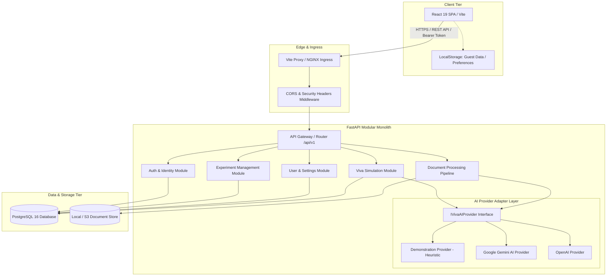
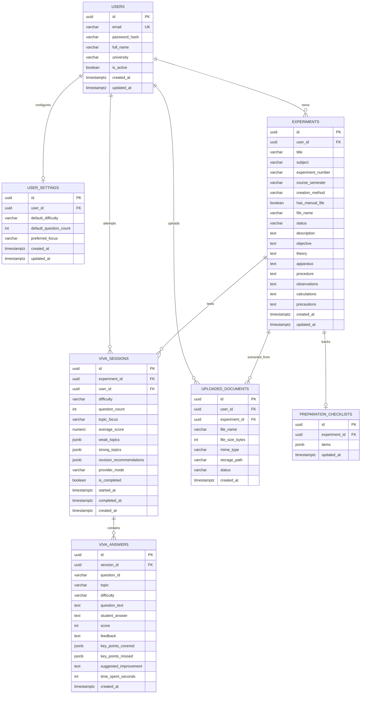
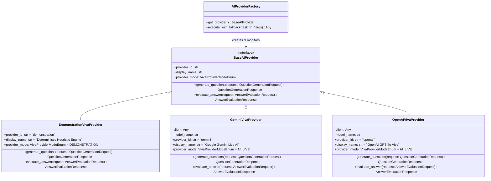
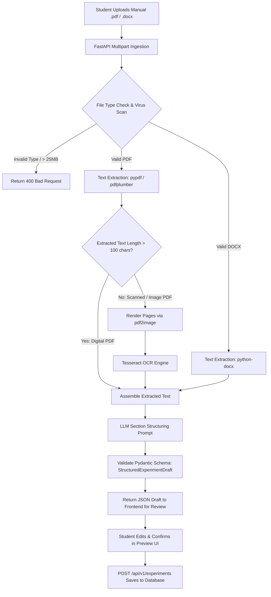

# PracPrep — Backend Architecture & System Design Specification

**Project:** PracPrep — From Lab Manual to Lab-Ready  
**Document Version:** 1.0.0  
**Date:** 2026-10-04  
**Author:** Senior Software Architect, Backend Engineer & Technical Lead  
**Status:** Approved Technical Architecture  

---

## 1. Architectural Philosophy & Technology Stack

The PracPrep backend is designed as a **clean, modular monolith** running on Python 3.12+ and FastAPI. It prioritizes simplicity, type safety, predictable performance, strict data isolation, and seamless integration with the existing React SPA.

### 1.1 Technology Stack Selection
| Component | Technology | Version | Architectural Rationale |
|---|---|---|---|
| **Programming Language** | Python | `>= 3.12` | High-level type hints, rich AI/LLM ecosystem, mature document extraction tooling |
| **Web Framework** | FastAPI | `>= 0.115` | Native ASGI asynchronous performance, automatic OpenAPI documentation, Pydantic v2 validation |
| **ORM & Database Layer** | SQLAlchemy 2.0 (Async) | `>= 2.0.35` | Modern declarative syntax, strict type safety, asynchronous query execution via `asyncpg` |
| **Database Migrations** | Alembic | `>= 1.13` | Deterministic, version-controlled schema migrations with autogenerate capabilities |
| **Relational Database** | PostgreSQL | `>= 16.0` | ACID compliance, JSONB support for checklists and question key points, robust relational indexing |
| **Data Validation** | Pydantic v2 | `>= 2.9` | High-performance C-extension validation, direct serialization to frontend TypeScript contracts |
| **Authentication & Crypto** | PyJWT + Passlib (Argon2) | `>= 2.9` / `>= 1.7` | Stateless JWT access/refresh token pair, industry-standard Argon2id password hashing |
| **Document Processing** | `pypdf`, `python-docx`, `pytesseract` | Latest | Robust text extraction from digital PDF/DOCX with OCR fallback for scanned lab manuals |
| **AI Client Layer** | Unified Adapter Pattern | — | Pluggable provider architecture supporting Google Gemini, OpenAI, and a built-in Demonstration engine |
| **Testing Suite** | Pytest + pytest-asyncio + HTTPX | Latest | Comprehensive asynchronous unit, integration, and security test coverage |

---

## 2. High-Level System Architecture



---

## 3. Backend Module Boundaries & Project Structure

The project will follow a modular domain structure within the `backend/` root directory:

```
backend/
├── alembic/                          # Alembic schema migrations
│   ├── env.py
│   └── versions/
├── app/
│   ├── __init__.py
│   ├── main.py                       # FastAPI application factory & middleware setup
│   ├── core/                         # Global cross-cutting concerns
│   │   ├── __init__.py
│   │   ├── config.py                 # Pydantic Settings reading .env
│   │   ├── database.py               # Async SQLAlchemy engine & session factory
│   │   ├── security.py               # Password hashing (Argon2) & JWT generation/validation
│   │   ├── exceptions.py             # Custom domain exception classes
│   │   ├── middleware.py             # Request timing, logging, and error envelope formatting
│   │   └── dependencies.py          # Shared FastAPI dependency injections (db session, current user)
│   ├── modules/                      # Domain-specific business modules
│   │   ├── auth/                     # Authentication & Token lifecycle
│   │   │   ├── models.py             # User model
│   │   │   ├── schemas.py            # User registration, login, token schemas
│   │   │   ├── services.py           # User verification, token creation
│   │   │   └── router.py             # Endpoints: /api/v1/auth/*
│   │   ├── users/                    # Profile & Settings management
│   │   │   ├── models.py             # UserSettings model
│   │   │   ├── schemas.py            # Profile update, settings sync, data export schemas
│   │   │   ├── services.py           # Profile modification, full export/wipe logic
│   │   │   └── router.py             # Endpoints: /api/v1/users/me/*
│   │   ├── experiments/              # Experiment CRUD & Checklists
│   │   │   ├── models.py             # Experiment, PreparationChecklist models
│   │   │   ├── schemas.py            # ExperimentRecord, FormData, Checklist schemas
│   │   │   ├── services.py           # Experiment ownership validation, CRUD
│   │   │   └── router.py             # Endpoints: /api/v1/experiments/*
│   │   ├── viva/                     # Viva Voce Simulator & Session Ledger
│   │   │   ├── models.py             # VivaSession, VivaAnswer models
│   │   │   ├── schemas.py            # VivaQuestion, Evaluation, SessionRecord schemas
│   │   │   ├── services.py           # Session lifecycle, score aggregation
│   │   │   └── router.py             # Endpoints: /api/v1/viva/*
│   │   ├── ai/                       # AI Adapter & Prompt Engineering
│   │   │   ├── __init__.py           # Public exports for AI module
│   │   │   ├── base.py               # BaseAIProvider abstract base class
│   │   │   ├── schemas.py            # Pydantic v2 AI boundary contracts
│   │   │   ├── exceptions.py         # Standardized AI provider exception taxonomy
│   │   │   ├── demonstration.py      # Deterministic keyword heuristic provider
│   │   │   ├── gemini.py             # Google Gemini implementation
│   │   │   ├── openai.py             # OpenAI implementation
│   │   │   ├── prompts.py            # System prompts & JSON schema templates
│   │   │   └── factory.py            # Provider factory with automatic fallback
│   │   └── documents/                # Document Ingestion & Parsing Pipeline
│   │       ├── models.py             # UploadedDocument metadata model
│   │       ├── extractor.py          # Text extraction from PDF/DOCX
│   │       ├── ocr.py                # Tesseract OCR fallback engine
│   │       ├── parser.py             # LLM-assisted section parser
│   │       └── router.py             # Endpoints: /api/v1/experiments/upload-manual
├── tests/                            # Comprehensive Pytest suite
│   ├── conftest.py                   # Async DB fixtures & mock clients
│   ├── test_auth.py
│   ├── test_experiments.py
│   ├── test_viva.py
│   ├── test_ai_adapters.py
│   └── test_document_processing.py
├── alembic.ini
├── pyproject.toml                    # Poetry / Pip dependency definitions
├── requirements.txt
├── Dockerfile                        # Multi-stage production container
└── docker-compose.yml                # Local development stack (FastAPI + PostgreSQL)
```

---

## 4. Database Schema & Entity Relationships

The relational schema guarantees data integrity, tenant isolation, and atomic updates. Server-generated **UUID v4** primary keys are used across all tables.



### Key Schema Constraints
- **Multi-Tenant Isolation:** `user_id` is a non-nullable foreign key with index on `experiments`, `viva_sessions`, and `uploaded_documents`. All repository queries filter by `user_id`.
- **Cascading Deletions:** Deleting an `experiment` cascades (`ON DELETE CASCADE`) to its `preparation_checklist`, associated `viva_sessions`, and `viva_answers`. Deleting a `user` purges all related child records.
- **Timezone Awareness:** All timestamps use PostgreSQL `TIMESTAMPTZ` (UTC).

---

## 5. Authentication, Token Lifecycle & Authorization

### 5.1 Token Architecture
- **Access Token:** Stateless JWT, signed via HMAC-SHA256 (`HS256`), 15-minute lifespan. Carries payload:
  ```json
  {
    "sub": "3fa85f64-5717-4562-b3fc-2c963f66afa6",
    "email": "student@pracprep.edu",
    "type": "access",
    "exp": 1728045600
  }
  ```
- **Refresh Token:** High-entropy cryptographically secure random token or long-lived JWT (7-day lifespan).
- **Transport Mechanism:** `Authorization: Bearer <token>` header for access tokens.

### 5.2 Authorization Flow & Dependency Injection
```python
# app/core/dependencies.py
async def get_current_user(
    token: str = Depends(oauth2_scheme),
    db: AsyncSession = Depends(get_db)
) -> User:
    payload = decode_access_token(token)
    user_id = payload.get("sub")
    if not user_id:
        raise CredentialsException()
    user = await get_user_by_id(db, uuid.UUID(user_id))
    if not user or not user.is_active:
        raise InactiveUserException()
    return user
```

---

## 6. Comprehensive API Endpoint Contracts (`/api/v1`)

### 6.1 Authentication Module (`/api/v1/auth`)
| Method | Endpoint | Description | Request Body | Response (200/201) |
|---|---|---|---|---|
| `POST` | `/register` | Register new student account | `RegisterRequest` (`email`, `password`, `name`, `university`) | `TokenResponse` + `UserResponse` |
| `POST` | `/login` | Authenticate with credentials | `LoginRequest` (`email`, `password`) | `TokenResponse` + `UserResponse` |
| `POST` | `/refresh` | Refresh expired access token | `RefreshRequest` (`refresh_token`) | `TokenResponse` |
| `POST` | `/logout` | Revoke current session token | `RefreshRequest` (`refresh_token`) | `{"message": "Logged out successfully"}` |

### 6.2 User & Settings Module (`/api/v1/users/me`)
| Method | Endpoint | Description | Request Body | Response |
|---|---|---|---|---|
| `GET` | `` | Get authenticated user profile | None | `UserResponse` |
| `PATCH` | `` | Update profile information | `UpdateUserRequest` (`name`, `university`) | `UserResponse` |
| `GET` | `/settings` | Get synchronized study settings | None | `UserSettingsResponse` |
| `PATCH` | `/settings` | Update study settings | `UpdateSettingsRequest` | `UserSettingsResponse` |
| `GET` | `/export` | Export full student data payload | None | `ExportDataPayload` (JSON file) |
| `DELETE` | `/data` | Clear all experiments & sessions | None | `{"message": "All data cleared"}` |
| `DELETE` | `` | Permanently delete account | None | `{"message": "Account deleted"}` |
| `POST` | `/migrate-guest-data` | Ingest local guest experiments/sessions | `GuestMigrationPayload` | `{"migrated_experiments": X, "migrated_sessions": Y}` |

### 6.3 Experiments Module (`/api/v1/experiments`)
| Method | Endpoint | Description | Request Body | Response |
|---|---|---|---|---|
| `GET` | `` | List user experiments (search, filter, sort) | Query params (`subject`, `status`, `search`) | `list[ExperimentRecordResponse]` |
| `POST` | `` | Create a new experiment | `CreateExperimentRequest` | `ExperimentRecordResponse` (201) |
| `GET` | `/{id}` | Retrieve experiment by UUID | None | `ExperimentRecordResponse` |
| `PATCH` | `/{id}` | Update experiment metadata/content | `UpdateExperimentRequest` | `ExperimentRecordResponse` |
| `DELETE` | `/{id}` | Delete experiment and cascading data | None | 204 No Content |
| `PATCH` | `/{id}/checklist` | Update checklist item toggles | `ChecklistUpdateRequest` | `dict[str, bool]` |
| `POST` | `/upload-manual` | Upload & parse lab manual file | Multipart form (`file`) | `StructuredExperimentDraft` |

### 6.4 Viva Voce Module (`/api/v1/viva`)
| Method | Endpoint | Description | Request Body | Response |
|---|---|---|---|---|
| `POST` | `/generate-questions` | Generate questions for an experiment | `GenerateQuestionsRequest` | `list[VivaQuestionResponse]` |
| `POST` | `/evaluate-answer` | Evaluate an answer against rubric | `EvaluateAnswerRequest` | `VivaEvaluationResponse` |
| `POST` | `/sessions` | Save a completed viva session record | `SaveSessionRequest` | `VivaSessionRecordResponse` (201) |
| `GET` | `/sessions` | List past viva sessions for user | Query param (`experiment_id` optional) | `list[VivaSessionRecordResponse]` |
| `GET` | `/sessions/{id}` | Get detailed viva session transcript | None | `VivaSessionRecordResponse` |
| `DELETE` | `/sessions/{id}` | Delete a past viva session | None | 204 No Content |

---

## 7. AI Provider Architecture & Fallback Mechanics

The AI subsystem employs the **Adapter Pattern** to isolate the application core from specific LLM providers.



### Fallback & Circuit Breaker Logic
1. The `AIProviderFactory` attempts calls against the active configured provider (e.g., `GeminiVivaProvider`).
2. If the external provider raises a timeout (`>= 4000ms`), an HTTP 429 (Rate Limit), or an HTTP 5xx error, the factory logs a structured warning and transparently delegates the execution to `DemonstrationVivaProvider`.
3. The response includes a metadata tag `providerMode: "demonstration" | "ai-live"` to inform the client transparently.

---

## 8. Lab Manual Document Processing Pipeline

The document ingestion pipeline processes uploaded lab manuals through a multi-stage extraction and structuring pipeline:



---

## 9. Error Handling, Logging & Security Architecture

### 9.1 Standardized Error Envelope
All error responses adhere to a consistent JSON structure matching frontend error parsers:
```json
{
  "error": {
    "code": "RESOURCE_NOT_FOUND",
    "message": "Experiment with id 'exp-123' does not exist or is not owned by current user.",
    "details": [
      {
        "field": "id",
        "issue": "Invalid UUID format"
      }
    ]
  }
}
```

### 9.2 Security Safeguards
1. **Password Hashing:** Passlib with Argon2id parameters (`memory_cost=65536, time_cost=3, parallelism=4`).
2. **CORS Configuration:** Explicit origin whitelist (`http://localhost:5173`, `http://127.0.0.1:5173`, production domain). Wildcard origins disallowed with credentials.
3. **Rate Limiting:** `slowapi` decorators applied to sensitive endpoints (e.g., 5 requests/minute for `/auth/login`, 10 requests/minute for `/viva/generate-questions`).
4. **Tenant Isolation:** Enforced via repository-level filters: `WHERE experiment.user_id = current_user.id`.

---

## 10. Containerization & Deployment Strategy

### 10.1 Multi-Stage Dockerfile
- **Build Stage:** Installs build essentials and compiles wheels.
- **Runtime Stage:** Slim Python 3.12 image, unprivileged system user (`appuser`), Tesseract OCR binaries, healthcheck endpoint `/health`.

### 10.2 Local Development with Docker Compose
A local `docker-compose.yml` provides:
- Service `backend`: FastAPI running on port 8000 with auto-reload.
- Service `db`: PostgreSQL 16 on port 5432 with persistent Docker volume.
- Network `pracprep-net`: Isolated bridge network.
