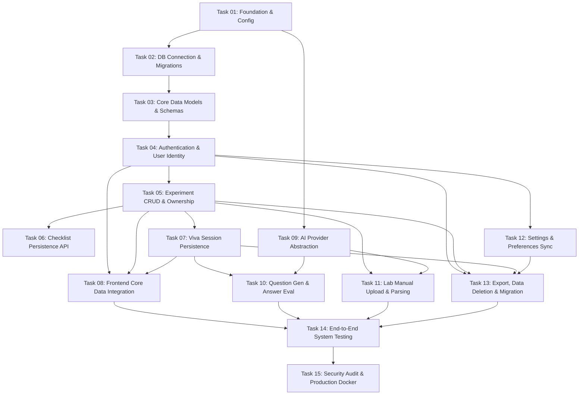

# PracPrep — Backend Implementation Roadmap & Execution Plan

**Project:** PracPrep — From Lab Manual to Lab-Ready  
**Document Version:** 1.0.0  
**Date:** 2026-10-04  
**Author:** Senior Software Architect, Backend Engineer & Technical Lead  
**Status:** Approved Implementation Roadmap  

---

## 1. Roadmap Architecture & Execution Philosophy

This roadmap organizes the development of the PracPrep backend into **15 discrete, dependency-aware implementation tasks**. 

### Guiding Principles:
1. **Strict Dependency Order:** Every task builds strictly on verified deliverables from prior tasks.
2. **Small, Independently Verifiable Units:** No single task combines multiple complex subsystems.
3. **Automated Verification:** Each task includes explicit acceptance criteria and corresponding Pytest test suites that must pass before advancing.
4. **Preservation of Frontend Workflows:** Frontend integration occurs only after the relevant backend modules are fully tested and stable.

---

## 2. Detailed Task Specifications

---

### Task 01: Backend Foundation & Configuration Setup
- **Task ID:** `TASK-01-FOUNDATION`
- **Objective:** Establish the foundational Python backend environment, directory hierarchy, FastAPI application factory, Pydantic settings management, and base health check endpoint.
- **Prerequisites:** None (Initial Task).
- **Scope:**
  - Create `backend/` directory structure.
  - Define `pyproject.toml` and `requirements.txt` with FastAPI, Pydantic v2, uvicorn, and pytest.
  - Implement `app/core/config.py` using `pydantic-settings` to load `.env`.
  - Implement `app/main.py` with FastAPI initialization, CORS middleware, and a `GET /health` endpoint.
- **Expected Files/Modules:**
  - `backend/requirements.txt`
  - `backend/pyproject.toml`
  - `backend/.env.example`
  - `backend/app/__init__.py`
  - `backend/app/main.py`
  - `backend/app/core/__init__.py`
  - `backend/app/core/config.py`
  - `backend/tests/conftest.py`
  - `backend/tests/test_health.py`
- **Acceptance Criteria:**
  - Running `uvicorn app.main:app` starts without errors on port 8000.
  - `GET /health` returns `200 OK` with payload `{"status": "healthy", "version": "1.0.0"}`.
  - CORS middleware accepts requests from configured `CORS_ORIGINS`.
- **Tests:** `tests/test_health.py` validating root health endpoint, CORS headers, and environment loading.
- **Definition of Done:** Automated test suite passes; health check responds; zero linting warnings.
- **Explicit Exclusions:** Database models, ORM connections, authentication, business endpoints.

---

### Task 02: Database Connection & Migration Infrastructure
- **Task ID:** `TASK-02-DB-INFRA`
- **Objective:** Configure asynchronous PostgreSQL database connectivity using SQLAlchemy 2.0 and establish Alembic migration infrastructure.
- **Prerequisites:** `TASK-01-FOUNDATION`
- **Scope:**
  - Implement `app/core/database.py` with `create_async_engine`, `async_sessionmaker`, and base declarative class.
  - Initialize Alembic with async driver support (`alembic init -t async alembic`).
  - Configure `alembic/env.py` to bind to the async database URL from `app/core/config.py`.
  - Provide database session dependency `get_db` for FastAPI route injection.
- **Expected Files/Modules:**
  - `backend/app/core/database.py`
  - `backend/alembic.ini`
  - `backend/alembic/env.py`
  - `backend/alembic/script.py.mako`
  - `backend/tests/test_database.py`
- **Acceptance Criteria:**
  - Alembic commands (`alembic upgrade head`, `alembic current`) execute cleanly.
  - `get_db` dependency yields an active `AsyncSession` and properly commits/rollbacks transactions.
- **Tests:** `tests/test_database.py` executing an asynchronous `SELECT 1` query via `get_db`.
- **Definition of Done:** Asynchronous connection verified; Alembic initialized; connection pool handles disconnects gracefully.
- **Explicit Exclusions:** Domain table definitions, business schemas, repository methods.

---

### Task 03: Core Data Models & Schemas
- **Task ID:** `TASK-03-CORE-MODELS`
- **Objective:** Define all declarative SQLAlchemy ORM models, relationships, cascading rules, and base Pydantic v2 schemas reflecting frontend types.
- **Prerequisites:** `TASK-02-DB-INFRA`
- **Scope:**
  - Define `User`, `UserSettings`, `Experiment`, `PreparationChecklist`, `VivaSession`, `VivaAnswer`, and `UploadedDocument` models.
  - Enforce server-generated UUID v4 primary keys and `TIMESTAMPTZ` UTC timestamps.
  - Generate initial baseline migration via `alembic revision --autogenerate -m "initial_schema"`.
- **Expected Files/Modules:**
  - `backend/app/modules/auth/models.py`
  - `backend/app/modules/users/models.py`
  - `backend/app/modules/experiments/models.py`
  - `backend/app/modules/viva/models.py`
  - `backend/app/modules/documents/models.py`
  - `backend/alembic/versions/*_initial_schema.py`
  - `backend/tests/test_models.py`
- **Acceptance Criteria:**
  - Alembic migration applies without errors on clean PostgreSQL instance.
  - Foreign key constraints, unique email constraints, and `ON DELETE CASCADE` rules verified.
- **Tests:** `tests/test_models.py` verifying model instantiation, relationship loading, and cascading deletion.
- **Definition of Done:** Database schema fully instantiated via migrations; all foreign key relationships verified by tests.
- **Explicit Exclusions:** API routers, authentication endpoints, frontend changes.

---

### Task 04: Authentication & User Identity API
- **Task ID:** `TASK-04-AUTH-API`
- **Objective:** Implement secure user registration, password hashing (Argon2id), JWT access/refresh token generation, authentication verification, and route protection dependencies.
- **Prerequisites:** `TASK-03-CORE-MODELS`
- **Scope:**
  - Implement `app/core/security.py` with password hashing and JWT encoding/decoding.
  - Implement `POST /api/v1/auth/register`, `POST /api/v1/auth/login`, `POST /api/v1/auth/refresh`, and `POST /api/v1/auth/logout`.
  - Implement `GET /api/v1/users/me` and `PATCH /api/v1/users/me` endpoints.
  - Implement `get_current_user` and `get_current_active_user` route dependencies.
- **Expected Files/Modules:**
  - `backend/app/core/security.py`
  - `backend/app/modules/auth/schemas.py`
  - `backend/app/modules/auth/services.py`
  - `backend/app/modules/auth/router.py`
  - `backend/app/modules/users/schemas.py`
  - `backend/app/modules/users/services.py`
  - `backend/app/modules/users/router.py`
  - `backend/tests/test_auth.py`
- **Acceptance Criteria:**
  - New user registers with valid email and password (returns 201 Created + token pair).
  - Duplicate email returns 409 Conflict.
  - Invalid password returns 401 Unauthorized.
  - Protected endpoints reject expired or missing tokens with 401.
- **Tests:** Comprehensive auth test suite covering registration, duplicate collision, valid login, invalid credentials, token refresh, and user profile retrieval.
- **Definition of Done:** 100% test coverage for authentication flows; secure token issuance verified.
- **Explicit Exclusions:** Social OAuth / SSO, email confirmation workflows.

---

### Task 05: Experiment Management CRUD & Ownership
- **Task ID:** `TASK-05-EXPERIMENTS-CRUD`
- **Objective:** Implement complete CRUD REST endpoints for experiments with strict user ownership isolation, filtering, search, and pagination.
- **Prerequisites:** `TASK-04-AUTH-API`
- **Scope:**
  - Implement `POST /api/v1/experiments` to create manual or draft experiments.
  - Implement `GET /api/v1/experiments` supporting query params (`subject`, `status`, `search`).
  - Implement `GET /api/v1/experiments/{id}` with 404 on non-existent or cross-user access.
  - Implement `PATCH /api/v1/experiments/{id}` for partial updates.
  - Implement `DELETE /api/v1/experiments/{id}` with cascading deletions.
- **Expected Files/Modules:**
  - `backend/app/modules/experiments/schemas.py`
  - `backend/app/modules/experiments/services.py`
  - `backend/app/modules/experiments/router.py`
  - `backend/tests/test_experiments.py`
- **Acceptance Criteria:**
  - Users can only read, update, and delete their own experiments.
  - Attempting to access another user's experiment returns 404 Not Found (preventing existence leaks).
  - Search query filters across `title` and `subject` case-insensitively.
- **Tests:** Unit and integration tests covering experiment creation, listing, searching, single-item retrieval, patch updates, and cross-user authorization barriers.
- **Definition of Done:** Experiment endpoints fully functional and tested; multi-tenant isolation mathematically enforced.
- **Explicit Exclusions:** Checklist toggle endpoint, file upload handling.

---

### Task 06: Preparation Checklist Persistence API
- **Task ID:** `TASK-06-CHECKLIST-API`
- **Objective:** Implement dedicated endpoint for updating experiment preparation checklist item toggles atomically.
- **Prerequisites:** `TASK-05-EXPERIMENTS-CRUD`
- **Scope:**
  - Implement `PATCH /api/v1/experiments/{id}/checklist` accepting `dict[str, bool]`.
  - Automatically initialize default 6 checklist items upon experiment creation.
  - Validate that the target experiment belongs to the authenticated user.
- **Expected Files/Modules:**
  - `backend/app/modules/experiments/services.py` (checklist helper methods)
  - `backend/app/modules/experiments/router.py` (endpoint addition)
  - `backend/tests/test_checklist.py`
- **Acceptance Criteria:**
  - Toggle states update atomically in `preparation_checklists` table.
  - Checklist state returned in standard `ExperimentRecordResponse` payload.
- **Tests:** `tests/test_checklist.py` testing checklist item toggles, invalid keys, and non-owner access rejection.
- **Definition of Done:** Checklist endpoints fully operational; seamless integration with `ExperimentRecord` schema.
- **Explicit Exclusions:** Custom user-defined checklist items.

---

### Task 07: Viva Session Persistence & History API
- **Task ID:** `TASK-07-VIVA-PERSISTENCE`
- **Objective:** Implement persistence and retrieval endpoints for completed viva session records, question-answer transcripts, and performance analytics.
- **Prerequisites:** `TASK-05-EXPERIMENTS-CRUD`
- **Scope:**
  - Implement `POST /api/v1/viva/sessions` to store completed sessions and individual `viva_answers`.
  - Implement `GET /api/v1/viva/sessions` supporting optional `experiment_id` filtering.
  - Implement `GET /api/v1/viva/sessions/{id}` returning full transcript and review details.
  - Implement `DELETE /api/v1/viva/sessions/{id}` for individual session removal.
- **Expected Files/Modules:**
  - `backend/app/modules/viva/schemas.py`
  - `backend/app/modules/viva/services.py`
  - `backend/app/modules/viva/router.py`
  - `backend/tests/test_viva_persistence.py`
- **Acceptance Criteria:**
  - Session and answer records stored atomically within a single database transaction.
  - Average score, weak topics, and strong topics correctly persisted in JSONB columns.
  - Sessions strictly scoped to the authenticated user.
- **Tests:** `tests/test_viva_persistence.py` validating session saving, transcript retrieval, experiment filtering, and deletion.
- **Definition of Done:** Full persistence layer for viva sessions operational and covered by tests.
- **Explicit Exclusions:** Live AI question generation or evaluation endpoints.

---

### Task 08: Frontend Core Data Integration
- **Task ID:** `TASK-08-FRONTEND-INTEGRATION-CORE`
- **Objective:** Introduce Axios/Fetch API client and Auth Context in the React frontend, replacing `localStorage` calls with backend REST calls for experiments, checklists, and viva sessions.
- **Prerequisites:** `TASK-04-AUTH-API`, `TASK-05-EXPERIMENTS-CRUD`, `TASK-06-CHECKLIST-API`, `TASK-07-VIVA-PERSISTENCE`
- **Scope:**
  - Create `src/services/apiClient.ts` with base URL, JWT bearer interceptor, and 401 token refresh logic.
  - Adapt `src/services/experimentStorage.ts` to forward calls to `/api/v1/experiments` for authenticated users while maintaining synchronous `localStorage` fallback for guests.
  - Adapt `src/services/vivaStorage.ts` to forward calls to `/api/v1/viva/sessions`.
  - Replace simulated auth in `src/pages/AuthPage.tsx` with live `/api/v1/auth/login` and `/api/v1/auth/register` calls.
- **Expected Files/Modules:**
  - `src/services/apiClient.ts`
  - `src/services/experimentStorage.ts`
  - `src/services/vivaStorage.ts`
  - `src/pages/AuthPage.tsx`
  - `src/components/dashboard/DashboardLayout.tsx`
- **Acceptance Criteria:**
  - User can sign up, log in, create experiments, toggle checklists, and view session history with data persisting to PostgreSQL.
  - Guest mode at `/guest` continues to function locally without errors.
  - No visual regressions or broken layout in any existing component.
- **Tests:** Manual verification across Dashboard, My Experiments, Workspace, and Viva Hub; frontend integration test script.
- **Definition of Done:** Core application fully integrated with live backend; zero UI regressions.
- **Explicit Exclusions:** AI question generation, document upload endpoints.

---

### Task 09: AI Provider Abstraction & Adapter Layer
- **Task ID:** `TASK-09-AI-ADAPTERS`
- **Objective:** Build the pluggable AI provider adapter architecture supporting Google Gemini, OpenAI, and a built-in deterministic Demonstration provider with automatic fallback.
- **Prerequisites:** `TASK-01-FOUNDATION`
- **Scope:**
  - Define `BaseAIProvider` abstract base class with `generate_questions` and `evaluate_answer`.
  - Port existing `DemonstrationVivaProvider` logic from TypeScript to Python.
  - Implement `GeminiVivaProvider` using Google GenAI SDK with structured output enforcement.
  - Implement `AIProviderFactory` with timeout detection, error handling, and demonstration fallback.
- **Expected Files/Modules:**
  - `backend/app/modules/ai/base.py`
  - `backend/app/modules/ai/demonstration.py`
  - `backend/app/modules/ai/gemini.py`
  - `backend/app/modules/ai/prompts.py`
  - `backend/app/modules/ai/factory.py`
  - `backend/tests/test_ai_adapters.py`
- **Acceptance Criteria:**
  - `DemonstrationVivaProvider` generates valid questions and evaluates answers deterministically.
  - Gemini provider formats prompts and parses JSON responses adhering to Pydantic schemas.
  - Factory automatically falls back to demonstration provider if external API key is invalid or request times out.
- **Tests:** Unit tests verifying prompt templates, demonstration heuristics, schema validation, and fallback trigger conditions.
- **Definition of Done:** Adapter layer complete and tested in isolation; fallback mechanism verified.
- **Explicit Exclusions:** HTTP route wiring, document processing.

---

### Task 10: Viva Question Generation & Answer Evaluation Endpoints
- **Task ID:** `TASK-10-VIVA-AI-ENDPOINTS`
- **Objective:** Expose `/api/v1/viva/generate-questions` and `/api/v1/viva/evaluate-answer` endpoints utilizing the AI provider adapter layer, and connect them to the frontend.
- **Prerequisites:** `TASK-08-FRONTEND-INTEGRATION-CORE`, `TASK-09-AI-ADAPTERS`
- **Scope:**
  - Implement `POST /api/v1/viva/generate-questions` and `POST /api/v1/viva/evaluate-answer`.
  - Implement `RemoteAIVivaProvider` in `src/services/vivaAIProvider.ts` calling these backend endpoints.
  - Connect `VivaActiveSession.tsx` to the remote provider.
- **Expected Files/Modules:**
  - `backend/app/modules/viva/router.py`
  - `src/services/vivaAIProvider.ts`
  - `backend/tests/test_viva_ai.py`
- **Acceptance Criteria:**
  - Viva Simulator generates curriculum-aligned questions within 3.5 seconds.
  - Submitting an answer returns numeric score, qualitative feedback, and covered/missed points within 2 seconds.
  - Simulator operates seamlessly even when backend falls back to demonstration engine.
- **Tests:** Backend route tests with mocked LLM calls; frontend end-to-end viva session execution test.
- **Definition of Done:** Viva simulator operates fully against backend AI service with zero client-side API keys.
- **Explicit Exclusions:** Lab manual file parsing.

---

### Task 11: Lab Manual Upload & Document Processing Pipeline
- **Task ID:** `TASK-11-DOC-PROCESSING`
- **Objective:** Implement multipart file upload, text extraction, OCR fallback, and LLM-assisted section structuring for `.pdf` and `.docx` lab manuals.
- **Prerequisites:** `TASK-05-EXPERIMENTS-CRUD`, `TASK-09-AI-ADAPTERS`
- **Scope:**
  - Implement `POST /api/v1/experiments/upload-manual` accepting multipart file upload.
  - Build text extraction pipeline using `pypdf` and `python-docx`.
  - Implement OCR fallback for scanned pages using `pytesseract`.
  - Implement LLM section extractor returning structured `StructuredExperimentDraft`.
  - Connect `LabManualUploader.tsx` in frontend to send uploaded files and populate the preview modal.
- **Expected Files/Modules:**
  - `backend/app/modules/documents/models.py`
  - `backend/app/modules/documents/extractor.py`
  - `backend/app/modules/documents/ocr.py`
  - `backend/app/modules/documents/parser.py`
  - `backend/app/modules/documents/router.py`
  - `src/components/experiment/LabManualUploader.tsx`
  - `src/components/experiment/NewExperimentPage.tsx`
  - `backend/tests/test_document_processing.py`
- **Acceptance Criteria:**
  - Digital PDF and DOCX files parsed into Theory, Apparatus, Procedure, Precautions, Observations.
  - Extracted draft displayed in frontend preview for student review before final creation.
  - Invalid formats or files > 25MB rejected with 400 Bad Request.
- **Tests:** Extraction tests on sample digital PDF, DOCX, and scanned image fixture.
- **Definition of Done:** End-to-end manual upload flow operational; frontend preview displays extracted content.
- **Explicit Exclusions:** Audio or video processing.

---

### Task 12: Settings & Study Preferences Synchronization
- **Task ID:** `TASK-12-SETTINGS-SYNC`
- **Objective:** Implement server-side synchronization of user study preferences and connect with the frontend Settings module.
- **Prerequisites:** `TASK-04-AUTH-API`, `TASK-08-FRONTEND-INTEGRATION-CORE`
- **Scope:**
  - Implement `GET /api/v1/users/me/settings` and `PATCH /api/v1/users/me/settings`.
  - Connect `src/services/settingsStorage.ts` to sync study preferences (default difficulty, question count, topic focus) to the backend for authenticated users.
  - Preserve display preferences (theme, density, reduced motion) in client-side storage.
- **Expected Files/Modules:**
  - `backend/app/modules/users/schemas.py`
  - `backend/app/modules/users/router.py`
  - `src/services/settingsStorage.ts`
  - `src/components/settings/StudyPreferencesSection.tsx`
  - `backend/tests/test_settings.py`
- **Acceptance Criteria:**
  - Changes to study preferences persist to PostgreSQL and reflect across sessions.
  - Display preferences remain instant and client-local.
- **Tests:** Settings persistence tests verifying default values and patch updates.
- **Definition of Done:** Settings page synchronizes study preferences with backend; theme toggling remains instant.
- **Explicit Exclusions:** Theme synchronization to server.

---

### Task 13: Data Export, Deletion & Guest Migration
- **Task ID:** `TASK-13-EXPORT-MIGRATION`
- **Objective:** Implement full data export, account/data deletion, and guest-to-account batch migration endpoints.
- **Prerequisites:** `TASK-05-EXPERIMENTS-CRUD`, `TASK-07-VIVA-PERSISTENCE`, `TASK-12-SETTINGS-SYNC`
- **Scope:**
  - Implement `GET /api/v1/users/me/export` returning complete JSON payload of user experiments and viva sessions.
  - Implement `DELETE /api/v1/users/me/data` (wipe user experiments and viva history).
  - Implement `DELETE /api/v1/users/me` (cascading user account deletion).
  - Implement `POST /api/v1/users/me/migrate-guest-data` for batch ingestion of local guest records.
  - Connect frontend Data & Privacy settings and Auth sign-up migration banner.
- **Expected Files/Modules:**
  - `backend/app/modules/users/services.py`
  - `backend/app/modules/users/router.py`
  - `src/components/settings/DataPrivacySection.tsx`
  - `src/components/settings/AccountActionsSection.tsx`
  - `src/pages/AuthPage.tsx`
  - `backend/tests/test_export_migration.py`
- **Acceptance Criteria:**
  - Export download yields JSON matching `ExportDataPayload` interface.
  - Data deletion purges all experiments and sessions while keeping user account active.
  - Guest data migrated seamlessly upon registration.
- **Tests:** Export verification test, cascade deletion test, and batch guest migration test.
- **Definition of Done:** GDPR-style export/deletion verified; guest migration operational.
- **Explicit Exclusions:** Third-party data backup integrations.

---

### Task 14: Comprehensive End-to-End System Testing
- **Task ID:** `TASK-14-E2E-TESTING`
- **Objective:** Conduct end-to-end integration testing across all 8 frontend modules communicating with the live FastAPI backend.
- **Prerequisites:** All prior tasks (Tasks 01 through 13).
- **Scope:**
  - Validate complete student journey: Sign up -> Upload Manual -> Review Draft -> Save Experiment -> Toggle Checklist -> Run Viva -> Review Score -> View Analytics -> Export Data.
  - Validate error scenarios (token expiry, invalid manual files, network disconnections, AI fallback).
- **Expected Files/Modules:**
  - `backend/tests/test_e2e_workflow.py`
  - `test-integration.mjs` (updated for live backend verification)
- **Acceptance Criteria:**
  - 100% of automated Pytest integration tests pass.
  - Frontend demonstrates zero visual or functional regressions across all routes.
- **Tests:** Automated end-to-end test suite simulating complete user lifecycle.
- **Definition of Done:** All functional requirements validated in integrated environment.
- **Explicit Exclusions:** Load testing with >1000 concurrent users.

---

### Task 15: Security Hardening, Production Docker & Deployment Readiness
- **Task ID:** `TASK-15-SECURITY-DOCKER`
- **Objective:** Harden security headers, configure rate limiting, optimize database indexes, and package application into production-grade multi-stage Docker containers.
- **Prerequisites:** `TASK-14-E2E-TESTING`
- **Scope:**
  - Implement rate limiting via `slowapi`.
  - Add security headers (`X-Content-Type-Options`, `X-Frame-Options`, `Content-Security-Policy`).
  - Create production multi-stage `Dockerfile` and `docker-compose.yml`.
  - Validate database query execution plans and index usage.
- **Expected Files/Modules:**
  - `backend/Dockerfile`
  - `backend/docker-compose.yml`
  - `backend/app/core/middleware.py`
  - `backend/tests/test_security.py`
- **Acceptance Criteria:**
  - Docker container builds cleanly and boots in production mode.
  - Rate limiting triggers HTTP 429 when thresholds are exceeded.
  - Security headers present on all responses.
- **Tests:** Security audit tests checking rate limits, CORS enforcement, and header presence.
- **Definition of Done:** Production-ready Docker container; security controls fully verified.
- **Explicit Exclusions:** Cloud deployment / Kubernetes manifests.
