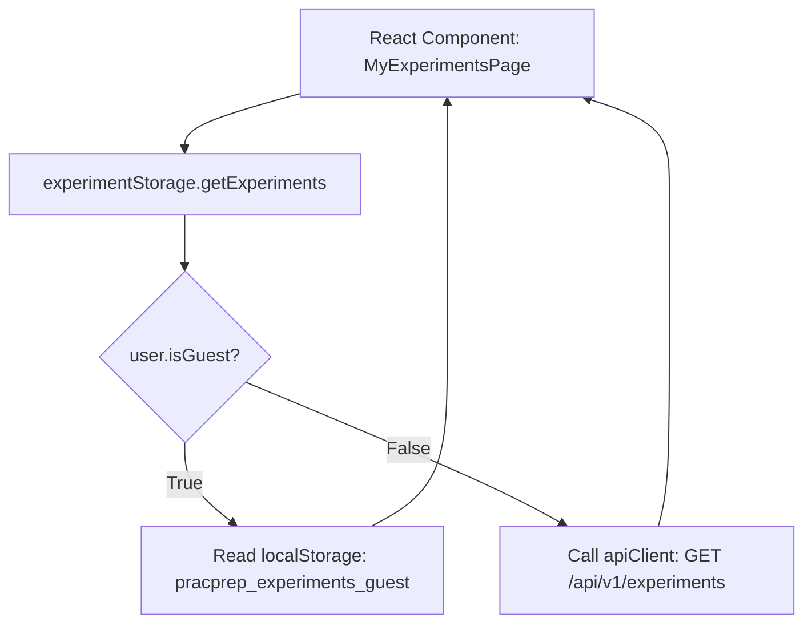
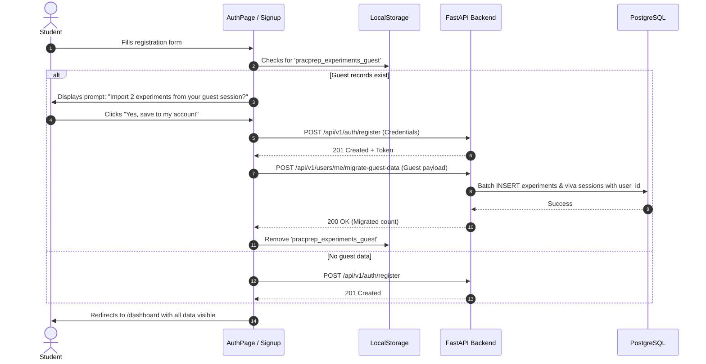

# PracPrep — Frontend-Backend Integration Plan

**Project:** PracPrep — From Lab Manual to Lab-Ready  
**Document Version:** 1.0.0  
**Date:** 2026-10-04  
**Author:** Senior Software Architect, Backend Engineer & Technical Lead  
**Status:** Approved Integration Specification  

---

## 1. Integration Strategy & Core Principles

The primary objective of the frontend-backend integration is to connect PracPrep's fully developed React 19 UI to the FastAPI REST backend **without altering the existing design, layout, component hierarchy, or user workflows**.

### Key Architectural Tenets:
1. **Preserve UI Component Code:** The existing components across Dashboard, Experiments, Workspace, Viva, Progress, and Settings must not be burdened with low-level network fetching logic.
2. **Adapter & Facade Pattern:** Existing storage services (`experimentStorage.ts`, `vivaStorage.ts`, `settingsStorage.ts`) will be converted into intelligent facade services that seamlessly switch between local `localStorage` (for guests) and the `/api/v1` REST backend (for authenticated users).
3. **Zero Visual Regressions:** All CSS classes, animations (GSAP, Framer Motion), icon bindings, and route layouts remain completely intact.
4. **Resilient Guest Experience:** Guest mode at `/guest` will continue to operate instantaneously without network roundtrips.

---

## 2. File-by-File Frontend Adaptation Matrix

The following table catalogs the exact frontend files requiring adaptation, their current implementation, and the specific integration changes planned:

| File Path | Current Mechanism | Target Integration Role | Risk Level |
|---|---|---|---|
| `src/services/apiClient.ts` | *(New file)* | Centralized HTTP client with JWT interceptors, base URL configuration, and error normalization. | Low |
| `src/services/authService.ts` | *(New file)* | Encapsulates login, registration, token refresh, and logout API calls. | Low |
| `src/context/AuthContext.tsx` | *(New file)* | Global React Context managing user authentication state, token storage, and guest session detection. | Medium |
| `src/pages/AuthPage.tsx` | `setTimeout(..., 1000)` mock; writes fake user object | Wires form submissions to `authService.login()` and `authService.register()`; handles server validation errors. | Medium |
| `src/components/dashboard/DashboardLayout.tsx` | Direct `localStorage.getItem('pracprep_user')` read | Consumes `useAuth()` hook; renders user name, email, and avatar dynamically from verified profile. | Medium |
| `src/services/experimentStorage.ts` | Direct `localStorage` read/write | Dual-mode facade: delegates to `apiClient` for authenticated users; retains `localStorage` for guests. | High |
| `src/services/vivaStorage.ts` | Direct `localStorage` read/write | Dual-mode facade: delegates to `apiClient` for authenticated users; retains `localStorage` for guests. | High |
| `src/services/settingsStorage.ts` | Direct `localStorage` read/write | Synchronizes `studyPreferences` with `/api/v1/users/me/settings`; keeps `theme` and `density` local. | Low |
| `src/services/vivaAIProvider.ts` | Deterministic `DemonstrationVivaProvider` | Introduces `RemoteAIVivaProvider` querying `/api/v1/viva/*`; falls back to demonstration provider on offline/error. | Medium |
| `src/components/experiment/LabManualUploader.tsx` | Captures `File` in React state without uploading | Dispatches `multipart/form-data` upload to `/api/v1/experiments/upload-manual`; receives structured draft. | Medium |
| `src/components/experiment/NewExperimentPage.tsx` | Manual form or empty upload metadata | Populates preview modal with structured draft extracted by backend document processing pipeline. | Medium |
| `src/components/viva/VivaActiveSession.tsx` | Queries in-memory demonstration provider | Queries `vivaAIProvider` (which now routes through backend); displays live feedback. | Low |
| `src/components/settings/DataPrivacySection.tsx` | Local JSON blob generation & storage wipe | Triggers `/api/v1/users/me/export` download and `/api/v1/users/me/data` wipe. | Low |
| `src/components/settings/AccountActionsSection.tsx` | Purges local keys & redirects | Triggers `/api/v1/auth/logout` and `/api/v1/users/me` account deletion. | Low |

---

## 3. API Client Architecture (`src/services/apiClient.ts`)

A lightweight HTTP client will be introduced using native `fetch` or `axios`:

```typescript
// Architectural sketch: src/services/apiClient.ts
const BASE_URL = import.meta.env.VITE_API_BASE_URL || '/api/v1';

export class ApiClient {
  private accessToken: string | null = null;

  setToken(token: string | null) {
    this.accessToken = token;
  }

  async request<T>(endpoint: string, options: RequestInit = {}): Promise<T> {
    const headers = new Headers(options.headers || {});
    headers.set('Content-Type', 'application/json');
    
    if (this.accessToken) {
      headers.set('Authorization', `Bearer ${this.accessToken}`);
    }

    const response = await fetch(`${BASE_URL}${endpoint}`, {
      ...options,
      headers,
    });

    if (response.status === 401) {
      // Attempt token refresh via authService
      const refreshed = await this.handleTokenRefresh();
      if (refreshed) {
        return this.request<T>(endpoint, options);
      }
      throw new Error('AUTH_EXPIRED');
    }

    if (!response.ok) {
      const errorData = await response.json().catch(() => ({}));
      throw new Error(errorData.error?.message || `HTTP ${response.status}`);
    }

    if (response.status === 204) {
      return {} as T;
    }

    return response.json();
  }

  private async handleTokenRefresh(): Promise<boolean> {
    // Logic to call /auth/refresh with refresh token
    return false;
  }
}

export const apiClient = new ApiClient();
```

---

## 4. Authentication State & Route Protection

### 4.1 React Auth Context (`src/context/AuthContext.tsx`)
A centralized context will encapsulate:
- `user: UserSession | null`
- `isAuthenticated: boolean`
- `isGuest: boolean`
- `isLoading: boolean`
- `login(credentials): Promise<void>`
- `register(payload): Promise<void>`
- `logout(): Promise<void>`

### 4.2 Route Guarding
In `src/App.tsx`, route matching will check `isAuthenticated` and `isGuest`:
- Routes under `/dashboard`, `/experiments`, `/progress`, and `/settings` will verify that an active session exists.
- If unauthenticated and path is not `/guest`, the router will redirect the student to `/login`.

---

## 5. Dual-Mode Storage Facade Pattern

To preserve the zero-latency, offline guest experience while supporting cloud persistence for registered users, existing storage modules will implement the **Dual-Mode Facade Pattern**:



### Example Implementation: `src/services/experimentStorage.ts`
```typescript
export const experimentStorage = {
  async getExperiments(user?: UserSession | null): Promise<ExperimentRecord[]> {
    if (!user || user.isGuest) {
      // Return local guest data immediately
      return getLocalGuestExperiments();
    }
    // Fetch from FastAPI backend
    return apiClient.request<ExperimentRecord[]>('/experiments');
  },

  async saveExperiment(formData: ExperimentFormData, user?: UserSession | null): Promise<ExperimentRecord> {
    if (!user || user.isGuest) {
      return saveLocalGuestExperiment(formData);
    }
    return apiClient.request<ExperimentRecord>('/experiments', {
      method: 'POST',
      body: JSON.stringify(formData),
    });
  }
};
```

---

## 6. Identifier Strategy: Server-Generated UUIDs

### 6.1 Transition from Client Timestamps
- Existing frontend generated IDs using `exp-${Date.now()}` and `viva-${Date.now()}`.
- The backend will generate standard **UUID v4** strings (e.g., `4fa85f64-5717-4562-b3fc-2c963f66afa6`).

### 6.2 Compatibility Handling
- All frontend interfaces (`ExperimentRecord.id`, `VivaSessionRecord.id`) already type `id` as `string`.
- No component assumes a numeric or timestamp format for `id`. Route matching in `App.tsx` captures `:id` via regex or path segments, which accepts UUID v4 without modification.

---

## 7. TypeScript Domain Model Alignment

All backend response schemas will match the frontend's camelCase naming convention (via Pydantic's `populate_by_name = True` and camelCase aliasing) or provide direct parity:

| Frontend TypeScript Field | Backend Pydantic Field | Serialization Alias |
|---|---|---|
| `experimentNumber` | `experiment_number` | `experimentNumber` |
| `courseSemester` | `course_semester` | `courseSemester` |
| `hasManualFile` | `has_manual_file` | `hasManualFile` |
| `fileName` | `file_name` | `fileName` |
| `createdAtTimestamp` | `created_at` (Unix ms) | `createdAtTimestamp` |
| `vivaQuestionsCount` | `viva_questions_count` | `vivaQuestionsCount` |
| `preparationChecklist` | `preparation_checklist` | `preparationChecklist` |

---

## 8. Guest-to-Account Migration Flow

When a guest user registers an account on `/signup`:



---

## 9. Regression Testing & Verification Protocol

To verify zero visual or functional regressions during and after integration, the following automated and manual testing protocol will be enforced:

### 9.1 Module Verification Matrix
1. **Application Shell & Navigation:**
   - Verify sidebar collapse/expand, breadcrumbs, search modal (⌘K), and user profile badge.
2. **Dashboard Overview:**
   - Verify KPI cards, preparation snapshot scores, and recent experiments render identically.
3. **New Experiment:**
   - Verify manual experiment creation creates records in PostgreSQL and redirects to workspace.
   - Verify PDF manual upload parses and populates the preview card.
4. **My Experiments:**
   - Verify table/grid switching, live search, subject filters, and status badges work smoothly.
   - Verify edit and delete modals update/remove records from the backend.
5. **Experiment Workspace:**
   - Verify all 7 content tabs (Overview, Theory, Apparatus, Procedure, Observations, Precautions, Checklist) display data accurately.
   - Verify checklist toggles persist across page reloads.
6. **Viva Simulator:**
   - Verify question generation pulls from backend AI service.
   - Verify instant answer submission, rubric scoring, and feedback rendering.
   - Verify results screen displays topic mastery bars and revision action items.
7. **Progress & Revision Center:**
   - Verify SVG performance trend chart, readiness list, and topic mastery bars compute correctly over API data.
8. **Settings & Data Management:**
   - Verify study preference edits sync to backend; verify theme toggling remains instant.
   - Verify JSON data export and account deletion work reliably.
