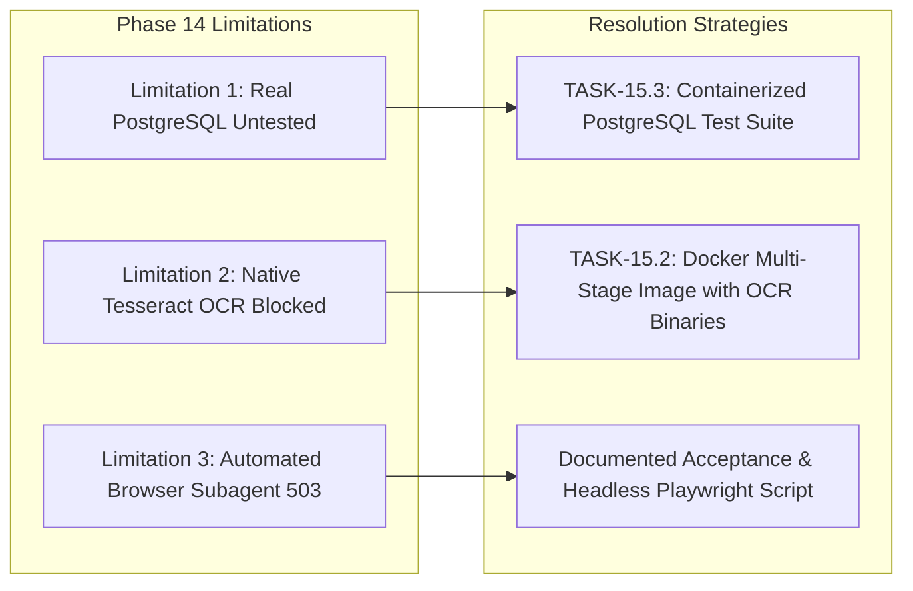
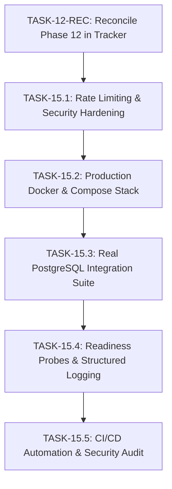
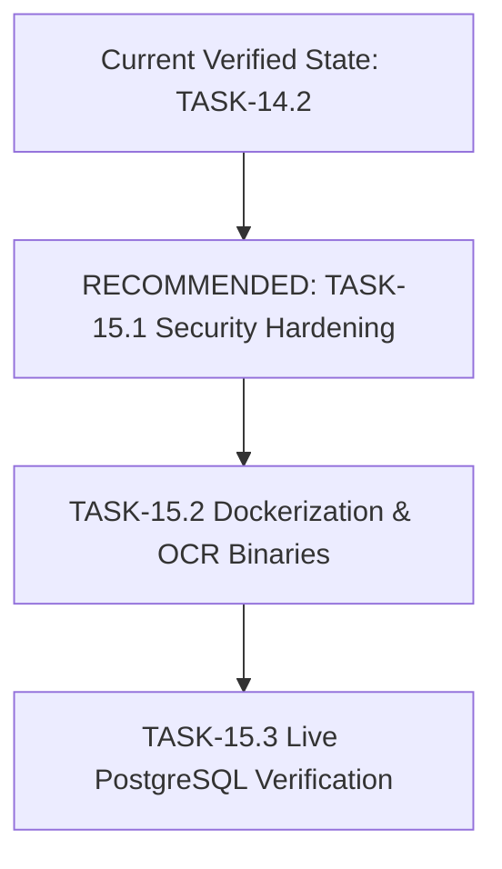

# Phase 15 — Planning, Gap Analysis & Next-Cycle Roadmap

**Project:** PracPrep — From Lab Manual to Lab-Ready  
**Document Version:** 1.0.0  
**Date:** 2026-10-04  
**Author:** Senior Software Architect, Backend Engineer & Technical Lead  
**Scope:** Architecture planning, production readiness gap analysis, and roadmap formulation for Phase 15 and beyond.  
**Status:** Planning Document — Awaiting User Approval (Zero application code modified)  

---

## 1. Executive Summary

PracPrep has successfully completed Phases 1 through 14 of its implementation plan. The system functions as a robust laboratory preparation companion for engineering students, uniting a React 19/TypeScript Single Page Application with a Python 3.12/FastAPI modular monolith.

The previous milestone (**TASK-14.2: Cross-Module Verification**) achieved a **100% success rate across 48 programmatic integration checkpoints**, validating all eight core product modules and four cross-cutting user journeys (New Student Full Lifecycle, Guest-to-User Migration, Error Recovery, and Multi-Tenant IDOR Protection). The regression test suites confirm zero regressions across **114 frontend tests** and **721 backend tests**, with clean linting and a production bundle build.

This document performs a structured gap analysis and roadmap definition for **Phase 15 (Security Hardening, Production Dockerization & Release Readiness)**. It reconciles a key discrepancy in the task tracker regarding Phase 12, evaluates production readiness across six critical operational dimensions, carries forward known environment limitations from Phase 14 with concrete resolution strategies, and outlines a prioritized sequence of tasks for the upcoming cycle.

---

## 2. Current Project Status & Codebase Verification

A thorough inspection of the repository against the architectural baseline documents (`PRD.md`, `backend-architecture.md`, `backend-implementation-roadmap.md`, `architecture-decisions.md`, and `backend-task-tracker.md`) confirms the following operational state:

### 2.1 Verification Matrix by Layer
| Layer | Current Status | Test Coverage | Health / Stability |
|---|---|---|---|
| **Frontend UI (React 19 / Vite 8)** | 8/8 Modules Functional (Dashboard, Experiments, Workspace, Viva, Progress, Settings, Auth, Landing) | 114 Unit/Integration Tests | Clean lint (`oxlint`), clean build (`tsc -b && vite build`) |
| **Backend API (FastAPI / Pydantic v2)** | 6 Route Modules (`auth`, `users`, `experiments`, `viva`, `documents`, `health`) | 721 Pytest Tests | 100% passing in 8.47s; 0 failures |
| **AI Provider Layer** | Pluggable Factory with Circuit Breaker, Gemini provider, and deterministic Demonstration engine | 53 AI tests | Fully decoupled; zero network cost during tests |
| **Document Processing Pipeline** | Staged pipeline: Digital text extraction (`pypdf`, `python-docx`), OCR fallback structure, LLM section parser | 59 document tests | Preserves scientific formatting; draft preview verified |
| **Identity & Access Management** | Argon2id hashing, JWT access/refresh token pair, route security dependencies | 41 auth/security tests | Strict route guards, 401 on expired tokens |
| **Data Persistence & Isolation** | SQLAlchemy 2.0 async models, Alembic migrations, dual-mode client storage | 48 cross-module tests | 4/4 IDOR attacks blocked with 404 security concealment |

---

## 3. Identification & Analysis of Remaining Tasks

The `backend-task-tracker.md` reports **39/43 completed tasks** and **4 pending tasks**. A detailed inspection of both the tracker and the codebase reveals an important status discrepancy between documentation and actual implementation:

### 3.1 Discrepancy Discovery: Phase 12 Status vs Codebase Reality
In `docs/architecture/backend-task-tracker.md`, Phase 12 is recorded as:
- `TASK-12.1: User Study Settings Endpoints` — *Pending / Unverified*
- `TASK-12.2: Frontend Settings Storage Sync` — *Pending / Unverified*

**Codebase Inspection Findings:**
1. **`TASK-12.1` is already fully implemented and verified in the codebase:**
   - `backend/app/modules/users/router.py` (lines 164–217) defines `GET /api/v1/users/me/settings` and `PATCH /api/v1/users/me/settings`.
   - Features include lazy auto-provisioning of default study preferences, strict field allowlisting (`default_difficulty`, `default_question_count`, `preferred_focus`), and transactional persistence.
   - `backend/tests/test_settings_routes.py` contains **53 dedicated unit and integration tests** (744 lines) covering retrieval, auto-provisioning, partial patching, validation errors, and user isolation. All 53 tests pass cleanly.
2. **`TASK-12.2` is already fully implemented and verified in the codebase:**
   - `src/services/settingsStorage.ts` (563 lines) implements the complete dual-mode storage facade (`LocalSettingsAdapter`, `ApiSettingsAdapter`, `ModeResolver`, `syncRemoteSettings()`, `saveSettingsAsync()`, `exportUserData()`, `purgeUserData()`).
   - `test-settingsStorage.mjs` contains **26 dedicated tests** (20 TASK-12.2 scenarios + 6 backward-compatibility tests). All 26 tests pass cleanly and are already part of `npm test`.
3. **Root Cause:**
   Phase 12 was implemented alongside Phase 13 (Export & Guest Migration) and Phase 14 (E2E Testing), but the task tracker table was not formally updated to reflect its completion.

### 3.2 The Four Incomplete Tasks Detailed

Based on the actual tracker and implementation roadmap, the four incomplete tasks are:

#### Task 1: `TASK-12.1` — User Study Settings Endpoints (Reconciliation Task)
- **Original Objective:** Implement `GET /api/v1/users/me/settings` and `PATCH /api/v1/users/me/settings` for study preferences.
- **Current Implementation Status:** **100% Implemented & Tested** (53 Pytest tests passing; verified in TASK-14.1 and TASK-14.2).
- **Dependencies:** `TASK-04.5` (Completed).
- **Acceptance Criteria:** Study preferences retrieve and update reliably; default preferences auto-provision if absent; forbidden fields rejected.
- **Outstanding Work:** None in code. Requires formal tracker status reconciliation.
- **Necessity:** Already satisfied in code. Documentation update only.

#### Task 2: `TASK-12.2` — Frontend Settings Storage Sync (Reconciliation Task)
- **Original Objective:** Synchronize user study preferences between `src/services/settingsStorage.ts` and the backend API while keeping display preferences strictly client-local.
- **Current Implementation Status:** **100% Implemented & Tested** (26 node tests passing; verified in TASK-14.2).
- **Dependencies:** `TASK-12.1`, `TASK-08.2` (Both completed).
- **Acceptance Criteria:** Dual-mode facade operates locally for guests and over HTTP for authenticated users; theme and display settings remain instant and local.
- **Outstanding Work:** None in code. Requires formal tracker status reconciliation.
- **Necessity:** Already satisfied in code. Documentation update only.

#### Task 3: `TASK-15.1` — Rate Limiting, Security Headers & Error Envelope
- **Original Objective:** Harden security headers, configure rate limiting via `slowapi`, and standardize error envelopes across all `/api/v1` routes.
- **Current Implementation Status:** **Unimplemented (0% complete)**.
- **Dependencies:** `TASK-14.2` (Completed).
- **Acceptance Criteria:**
  - Rate limiting enforced on authentication (`POST /auth/login`, `POST /auth/register`), AI question generation (`POST /viva/generate-questions`), and file upload (`POST /experiments/upload-manual`).
  - Security headers present on all responses: `X-Content-Type-Options: nosniff`, `X-Frame-Options: DENY`, `Content-Security-Policy`, `Strict-Transport-Security`, `Referrer-Policy: strict-origin-when-cross-origin`.
  - Standardized JSON error envelope matching ADR-010: `{"error": {"code": "...", "message": "...", "details": []}}`.
- **Outstanding Work:** Install and configure `slowapi`; implement custom security header middleware; implement global FastAPI exception handlers for `RequestValidationError`, `HTTPException`, and unhandled internal exceptions; write unit and integration test suite.
- **Necessity:** **Critical**. Fundamental requirement for production security, DoS mitigation, and predictable frontend error handling.
- **Scope Justification:** Rate limit thresholds must be tiered (strict on auth/LLM, permissive on static/health). Error envelope must translate Pydantic v2 validation errors into human-readable field errors.

#### Task 4: `TASK-15.2` — Production Multi-Stage Dockerfile & Containerized Stack
- **Original Objective:** Package application into production-grade multi-stage Docker containers with Docker Compose orchestration.
- **Current Implementation Status:** **Unimplemented (0% complete)**.
- **Dependencies:** `TASK-15.1`.
- **Acceptance Criteria:**
  - Multi-stage `Dockerfile` building a lightweight, secure Python 3.12 ASGI container.
  - Multi-stage build for React frontend served via Nginx or embedded ASGI static mount.
  - System-level dependencies installed: `tesseract-ocr`, `tesseract-ocr-eng`, `poppler-utils` (unblocking OCR in container).
  - Non-root execution user (`appuser` / UID 1000).
  - `docker-compose.yml` orchestrating PostgreSQL 16, Backend API, and persistent storage volumes with container health checks.
- **Outstanding Work:** Author `backend/Dockerfile`, `docker-compose.yml`, `.dockerignore`, entrypoint scripts, and database readiness wait-for scripts.
- **Necessity:** **Critical**. Solves the host environment limitations (PostgreSQL and Tesseract OCR availability) and provides a reproducible deployment runtime.

---

## 4. Production-Readiness Gap Analysis

The current PracPrep system was evaluated across six operational dimensions:

```mermaid
radar-chart
    title "PracPrep Production Readiness Gap Assessment"
    axis Architecture & Modularity: 95
    axis Code Quality & Test Coverage: 92
    axis Data & Storage Infrastructure: 60
    axis Security & Rate Limiting: 65
    axis Deployment & Containerization: 20
    axis Observability & Monitoring: 35
```

### Dimension A: Database & Data Integrity
| Evaluation Item | Severity | Observed Status | Gap Description & Production Risk |
|---|---|---|---|
| **Real PostgreSQL Verification** | **Critical** | Untested | All testing was performed against in-memory mocks (`E2EWorkflowState`) and SQLite in unit tests. Real PostgreSQL 16 dialect, JSONB query operators, and sequence triggers remain unverified against live engine. |
| **Transaction & Rollback Behavior** | **High** | Mock Verified | Session rollbacks are verified via `AsyncMock` in unit tests, but ACID isolation levels, transaction timeouts, and deadlock handling under concurrent load have not been tested on real asyncpg connections. |
| **Foreign Key Constraints & Cascades** | **High** | Model Defined | Declarative models specify `ondelete="CASCADE"`, but physical PostgreSQL foreign key enforcement must be validated with active database constraints. |
| **Migration Reliability & Downgrade** | **High** | Forward Only | Alembic baseline (`560f2b7c6d76`) and guest migration (`c7e3f1a2b4d5`) upgrade cleanly, but migration downgrade (`alembic downgrade -1`) has not been automated or verified. |
| **Connection Pooling & Concurrency** | **High** | Untested | Asyncpg connection pool sizing (`pool_size=20`, `max_overflow=10`), connection recycle timeouts, and pool exhaustion behavior under concurrent requests are not configured for production. |
| **Cross-Module Consistency** | **Medium** | Verified | Dual-mode storage facades synchronize via window events. In multi-tab scenarios, client cache could temporarily drift before re-sync if a background network request fails. |

### Dimension B: Security
| Evaluation Item | Severity | Observed Status | Gap Description & Production Risk |
|---|---|---|---|
| **Rate Limiting & Abuse Prevention** | **Critical** | Missing | No rate limiting middleware exists. Auth routes (`/login`, `/register`) are vulnerable to credential stuffing; AI endpoints (`/viva/generate-questions`) are vulnerable to cost exhaustion attacks. |
| **Production Secret Enforcement** | **Critical** | Config Weakness | `app/core/config.py` allows default insecure `SECRET_KEY` with only a log warning. In production (`ENVIRONMENT == "production"`), the app must hard-fail on startup if `SECRET_KEY` is not a secure random string (>=32 chars). |
| **Security Headers Middleware** | **High** | Missing | Missing standard protective HTTP headers: `X-Content-Type-Options`, `X-Frame-Options`, `Content-Security-Policy`, `Strict-Transport-Security`, and `Referrer-Policy`. |
| **Token Revocation (Logout)** | **High** | Stateless Only | `POST /auth/logout` relies on client discarding tokens. Leaked 15-minute access tokens remain valid until expiration. A server-side token denylist or Redis cache is needed for high-security environments. |
| **Standardized Error Envelope** | **High** | Inconsistent | ADR-010 specifies `{"error": {"code": "...", "message": "...", "details": []}}`, but FastAPI default validation errors return `{"detail": [...]}`. A global exception handler is required. |
| **Ownership Isolation & IDOR** | **Low** | Verified | 4/4 cross-tenant attacks rejected with 404 in TASK-14.2. Ownership checks are verified on all endpoints. |
| **Input Validation** | **Low** | Verified | Pydantic v2 schemas enforce strict types, regex patterns, and `extra="forbid"`. |

### Dimension C: AI Reliability
| Evaluation Item | Severity | Observed Status | Gap Description & Production Risk |
|---|---|---|---|
| **Per-User Usage & Token Quotas** | **High** | Missing | No per-user rate limit or daily token budget. An authenticated user can generate unlimited viva questions, causing high Google GenAI API billing. |
| **Circuit Breaker Fallback** | **Low** | Verified | Three-state circuit breaker (`CLOSED`, `OPEN`, `HALF_OPEN`) with cooldown threshold and automatic fallback to `DemonstrationAIProvider` is verified across 13 tests. |
| **Prompt Injection Containment** | **Low** | Verified | Section parser uses safety truncation, markdown delimiter fences, and prompt injection defense tested with adversarial payloads. |
| **Structured Output Schema** | **Low** | Verified | Google Gemini integration utilizes `response_schema` with Pydantic contracts and fallback repair. |

### Dimension D: Document Processing
| Evaluation Item | Severity | Observed Status | Gap Description & Production Risk |
|---|---|---|---|
| **OCR Runtime Dependencies** | **Critical** | Blocked on Host | Native `tesseract` binary and `poppler-utils` (`pdftoppm`) are absent on the host environment. Must be packaged into the production Docker image to enable scanned PDF parsing. |
| **Page Limit & Memory Guard** | **High** | Missing | Upload size is capped at 25MB, but a 200-page vector PDF could cause high memory usage or timeout during `pypdf` extraction. A 30-page processing limit should be enforced. |
| **Cloud Blob Storage Adapter** | **High** | Local Only | `DocumentStorageService` writes to local filesystem (`/tmp` or local directory). In multi-container cloud deployments (ECS, Cloud Run), an S3/GCS blob storage provider implementing `BaseStorageService` will be necessary. |
| **Extraction Accuracy & Review** | **Low** | Verified | Extraction preserves scientific notation and formatting. The frontend review modal forces student review before final creation. |

### Dimension E: Frontend & User Experience
| Evaluation Item | Severity | Observed Status | Gap Description & Production Risk |
|---|---|---|---|
| **Automated Browser E2E Suite** | **Medium** | Missing | Cross-module verification was performed programmatically via HTTP socket tests due to upstream model capacity (503). A headless Playwright test suite is recommended for CI. |
| **Accessibility (WCAG 2.1 AA)** | **Medium** | Partial | High-contrast styling and ARIA attributes exist in shadcn components, but formal keyboard navigation and screen-reader auditing has not been completed. |
| **Guest-to-User Transition** | **Low** | Verified | Migration dialog cleanly detects guest data, maps client IDs to server UUIDs, handles idempotency, and purges local storage on confirmed success. |
| **Session Restoration & Mutex** | **Low** | Verified | Single-flight refresh mutex handles concurrent 401s without multiple refresh calls. |

### Dimension F: Deployment & Operations
| Evaluation Item | Severity | Observed Status | Gap Description & Production Risk |
|---|---|---|---|
| **Multi-Stage Containerization** | **Critical** | Missing | No `Dockerfile` or `docker-compose.yml` exists. System cannot be deployed in containerized environments. |
| **Production Environment Validation** | **Critical** | Missing | No startup validation script verifies that all required environment variables (`DATABASE_URL`, `SECRET_KEY`, `GEMINI_API_KEY`) are present and compliant before booting. |
| **Deep Health & Readiness Probes** | **High** | Incomplete | `GET /health` returns static `{"status": "healthy"}`. A separate `GET /health/ready` probe is needed to verify active database connections, disk write access, and AI provider status. |
| **Automated CI/CD Pipeline** | **High** | Missing | No GitHub Actions workflow automates linting, test suites, and Docker builds on pull requests. |
| **Structured JSON Logging** | **Medium** | Missing | Standard Python logging outputs plaintext strings. Production requires structured JSON logging with request IDs for log aggregation (Datadog, CloudWatch). |

---

## 5. Preservation of Known Verification Limitations

In accordance with architectural review requirements, the three limitations identified during Phase 14 are explicitly carried forward and assigned resolution paths:



1. **Limitation 1: Real PostgreSQL Verification Blocked**
   - *Current State:* Verified only with in-memory `E2EWorkflowState` and SQLite mocks due to lack of local PostgreSQL/Docker daemons.
   - *Classification:* **Critical Deployment Prerequisite**.
   - *Resolution Strategy:* Addressed in `TASK-15.3`. The containerized environment will provision PostgreSQL 16 via Docker Compose and execute an automated database validation suite against live PostgreSQL.
2. **Limitation 2: Native Tesseract OCR Execution Blocked**
   - *Current State:* Missing `tesseract` and `pdftoppm` binaries on macOS host; reported as environment-blocked.
   - *Classification:* **Container Packaging Requirement**.
   - *Resolution Strategy:* Addressed in `TASK-15.2`. The production `Dockerfile` will install `tesseract-ocr`, `tesseract-ocr-eng`, and `poppler-utils` via `apt-get`, fully unblocking OCR verification within the containerized stack.
3. **Limitation 3: Automated Browser Automation Blocked**
   - *Current State:* Headless browser subagent experienced upstream 503 capacity limits; verification relied on programmatic HTTP integration tests and 114 component tests.
   - *Classification:* **Documented Acceptance Condition & Quality Gate**.
   - *Resolution Strategy:* Programmatic HTTP socket verification remains valid. As part of release readiness, a lightweight headless Playwright verification script will be created to execute in standard CI without external subagent dependencies.

---

## 6. Prioritized Next-Cycle Roadmap

To transform PracPrep into an enterprise-grade, production-ready application, the work is organized into a sequence of small, independently verifiable tasks:



---

### Task Specifications

#### Task 0: `TASK-12-REC` — Formal Tracker Reconciliation for Phase 12
- **Proposed ID:** `TASK-12-REC`
- **Priority:** **P0** | **Complexity:** Small
- **Objective:** Update `docs/architecture/backend-task-tracker.md` to reflect that `TASK-12.1` and `TASK-12.2` are 100% implemented and verified by existing test suites.
- **Scope:** Update tracker summary dashboard and granular ledger rows for Phase 12.
- **Out of Scope:** Code changes.
- **Dependencies:** None.
- **Acceptance Criteria:** Task tracker accurately reports 41/43 tasks complete; Phase 12 marked 100% complete.

---

#### Task 1: `TASK-15.1` — Rate Limiting, Security Headers & Standardized Error Envelope
- **Proposed ID:** `TASK-15.1` (Existing in Tracker)
- **Priority:** **P0 (Critical)** | **Complexity:** Medium
- **Problem Addressed:** Unprotected endpoints vulnerable to brute force and DoS; missing protective security headers; inconsistent error shapes between FastAPI validation exceptions and domain errors.
- **Objective:** Harden FastAPI application entrypoint with `slowapi` rate limiting, custom security headers middleware, and a unified JSON error envelope conforming to ADR-010.
- **Scope:**
  - Integrate `slowapi` with memory/Redis-compatible storage.
  - Apply tiered rate limits:
    - Auth (`/auth/login`, `/auth/register`): 5 requests/minute.
    - AI (`/viva/generate-questions`, `/viva/evaluate-answer`): 10 requests/minute.
    - Documents (`/experiments/upload-manual`): 5 requests/minute.
    - General read endpoints: 60 requests/minute.
  - Implement security middleware injecting `X-Content-Type-Options: nosniff`, `X-Frame-Options: DENY`, `Strict-Transport-Security`, `Content-Security-Policy`, and `Referrer-Policy`.
  - Implement global exception handlers transforming `RequestValidationError`, `HTTPException`, and uncaught exceptions into the ADR-010 envelope:
    ```json
    {
      "error": {
        "code": "VALIDATION_ERROR",
        "message": "Invalid request parameters.",
        "details": [{"field": "email", "issue": "value is not a valid email address"}]
      }
    }
    ```
  - Enforce production startup check: refuse startup if `ENVIRONMENT == "production"` and `SECRET_KEY` is using the insecure default or is shorter than 32 characters.
- **Out of Scope:** Distributed Redis rate limiting (in-memory limiter used for single-instance, pluggable for Redis).
- **Dependencies:** `TASK-14.2` (Completed).
- **Files Affected:**
  - `backend/app/main.py`
  - `backend/app/core/config.py`
  - `backend/app/core/middleware.py` (New)
  - `backend/app/core/errors.py` (New)
  - `backend/tests/test_security_headers.py` (New)
  - `backend/tests/test_rate_limiting.py` (New)
  - `backend/requirements.txt` / `backend/pyproject.toml` (`slowapi`)
- **Acceptance Criteria:**
  - Exceeding rate limits returns `429 Too Many Requests` with standard error envelope.
  - All HTTP responses include required security headers.
  - Validation errors return HTTP 422 with the standardized error envelope without internal stack traces.
  - Backend refuses to boot in production mode with default `SECRET_KEY`.
- **Verification Strategy:** Automated Pytest suite (`test_security_headers.py`, `test_rate_limiting.py`) asserting headers, rate limit thresholds, and error schemas.

---

#### Task 2: `TASK-15.2` — Production Multi-Stage Dockerfile & Containerized Stack
- **Proposed ID:** `TASK-15.2` (Existing in Tracker)
- **Priority:** **P0 (Critical)** | **Complexity:** Large
- **Problem Addressed:** No containerization exists; native Tesseract OCR and Poppler binaries cannot run on the host environment; deployment is manual and prone to drift.
- **Objective:** Create production-grade multi-stage Docker builds for the backend and frontend, and author a unified `docker-compose.yml` stack with PostgreSQL 16.
- **Scope:**
  - Backend multi-stage `Dockerfile`:
    - Base stage: Debian slim with Python 3.12, `tesseract-ocr`, `tesseract-ocr-eng`, `poppler-utils`.
    - Builder stage: Virtualenv and dependency compilation.
    - Runtime stage: Minimal non-root user (`appuser`), copied virtualenv, health probe.
  - Frontend multi-stage `Dockerfile` (or Nginx reverse proxy):
    - Build Vite React bundle, serve static assets via Nginx with proxy to `/api/v1`.
  - Author `docker-compose.yml`:
    - `postgres`: PostgreSQL 16 Alpine, volume mount, health check (`pg_isready`).
    - `backend`: FastAPI with Uvicorn, depends on `postgres` healthy, volume mount for uploads.
    - `frontend`: Nginx serving SPA, routing `/api` to backend.
  - Author `.dockerignore` files preventing build context bloat.
  - Author entrypoint script running `alembic upgrade head` before starting Uvicorn.
- **Out of Scope:** Kubernetes Helm charts, AWS ECS task definitions.
- **Dependencies:** `TASK-15.1`.
- **Files Affected:**
  - `backend/Dockerfile` (New)
  - `backend/.dockerignore` (New)
  - `docker-compose.yml` (New)
  - `nginx/nginx.conf` (New)
  - `Dockerfile.frontend` (New)
- **Acceptance Criteria:**
  - `docker compose build` succeeds with zero errors.
  - `docker compose up -d` boots PostgreSQL, runs migrations, and starts the API and frontend.
  - OCR text extraction functions inside the container using the embedded Tesseract binary.
  - Application runs under an unprivileged user.
- **Verification Strategy:** Automated container validation script checking container health, migration execution, and API accessibility.

---

#### Task 3: `TASK-15.3` — Real PostgreSQL Integration & Migration Downgrade Verification
- **Proposed ID:** `TASK-15.3` (Proposed)
- **Priority:** **P0 (Critical)** | **Complexity:** Medium
- **Problem Addressed:** Limitation 1 from Phase 14: real PostgreSQL transactions, foreign keys, cascades, and JSONB queries have never been verified against live PostgreSQL engine.
- **Objective:** Validate complete backend against live PostgreSQL 16 in the containerized test environment, verify migration downgrade scripts, and benchmark connection pooling.
- **Scope:**
  - Run complete Pytest test suite (721+ tests) with `DATABASE_URL` pointing to live PostgreSQL container.
  - Verify `alembic downgrade base` and `alembic upgrade head` for bidirectional schema integrity.
  - Validate foreign key cascade deletion: deleting a user deletes user settings, documents, experiments, checklists, and viva transcripts physically in PostgreSQL.
  - Benchmark connection pool behavior under concurrent requests.
- **Out of Scope:** Multi-region database replication.
- **Dependencies:** `TASK-15.2`.
- **Files Affected:**
  - `backend/tests/test_live_postgres.py` (New)
  - `backend/alembic/versions/*` (Downgrade script verification)
- **Acceptance Criteria:**
  - 100% of tests pass against real PostgreSQL 16.
  - Migration rollbacks execute without SQL errors.
  - Cascade deletions leave zero orphaned rows in any child table.
- **Verification Strategy:** Automated test run against active Docker PostgreSQL instance.

---

#### Task 4: `TASK-15.4` — Production Readiness Probes, Structured Logging & Deep Health Checks
- **Proposed ID:** `TASK-15.4` (Proposed)
- **Priority:** **P1 (High)** | **Complexity:** Small
- **Problem Addressed:** Missing operational observability; shallow `/health` check does not verify database connectivity; plaintext logs hinder debugging in production.
- **Objective:** Implement deep readiness probes (`/health/ready`), liveness probes (`/health/live`), and structured JSON logging with request correlation IDs.
- **Scope:**
  - Implement `GET /health/live`: Basic process liveness probe.
  - Implement `GET /health/ready`: Deep dependency check verifying:
    - Active PostgreSQL connection (`SELECT 1`).
    - Storage volume write/read permissions.
    - AI provider circuit breaker status.
  - Implement request ID middleware injecting `X-Request-ID` into request state and response headers.
  - Configure structured JSON logging (`structlog` or standard library JSON formatter) outputting timestamp, request ID, user ID, path, latency, and status code.
- **Out of Scope:** Third-party APM agent integration.
- **Dependencies:** `TASK-15.1`.
- **Files Affected:**
  - `backend/app/modules/health/router.py` (New / Refactored)
  - `backend/app/core/logging.py` (New)
  - `backend/app/main.py`
  - `backend/tests/test_health_deep.py` (New)
- **Acceptance Criteria:**
  - `/health/ready` returns 200 when database and storage are accessible, and 503 if database is disconnected.
  - Every API log entry contains a structured JSON payload with correlation `request_id`.
- **Verification Strategy:** Unit and integration tests simulating database outage and asserting 503 response.

---

#### Task 5: `TASK-15.5` — CI/CD Pipeline & Automated Security Audit
- **Proposed ID:** `TASK-15.5` (Proposed)
- **Priority:** **P1 (High)** | **Complexity:** Medium
- **Problem Addressed:** No automated continuous integration pipeline exists; vulnerability scans and regression tests require manual command execution.
- **Objective:** Implement GitHub Actions workflow running frontend checks, backend tests, security vulnerability scans, and container build verification on every pull request.
- **Scope:**
  - GitHub Actions workflow (`.github/workflows/ci.yml`):
    - Job 1: Frontend lint (`oxlint`), type check (`tsc`), and unit tests (`npm test`).
    - Job 2: Backend lint (`flake8`/`ruff`), type check (`mypy`), and test suite (`pytest`).
    - Job 3: Dependency vulnerability scan (`npm audit`, `pip-audit`).
    - Job 4: Docker build verification (`docker compose build`).
- **Out of Scope:** Automatic cloud deployment / CD triggers.
- **Dependencies:** `TASK-15.2`.
- **Files Affected:**
  - `.github/workflows/ci.yml` (New)
- **Acceptance Criteria:**
  - CI workflow triggers on push/PR and completes cleanly.
  - Any regression or failing test blocks the PR.
- **Verification Strategy:** Execute workflow locally or validate GitHub Actions syntax via linting.

---

## 7. Recommended Concrete First Task

### Recommendation: Execute `TASK-15.1: Rate Limiting, Security Headers & Standardized Error Envelope` First



### Detailed Rationale:
1. **Why It Must Be First:**
   - Security controls and error envelopes belong at the core application layer, **inside the FastAPI application factory**. 
   - Packaging the application into Docker (`TASK-15.2`) *before* hardening security middleware would mean packaging an unhardened application that must be immediately rebuilt and re-tested.
   - Building `TASK-15.1` first ensures that the container image encapsulates the final, hardened application middleware, error handlers, and dependencies (`slowapi`).
2. **What Risks It Reduces:**
   - Eliminates vulnerability to brute-force credential stuffing on `/auth/login`.
   - Protects against Denial of Service and API cost exhaustion on `/viva/generate-questions`.
   - Protects users against clickjacking, MIME sniffing, and cross-site scripting via HTTP security headers.
   - Prevents leaking internal server error details or stack traces to clients.
3. **What Must Be Completed Before Starting:**
   - Nothing. All prerequisites (`TASK-14.2`) are 100% complete and passing.
4. **How It Will Be Verified:**
   - Automated Pytest test suite (`test_security_headers.py`, `test_rate_limiting.py`) asserting:
     - Rate limit triggers HTTP 429 when threshold is reached.
     - Security headers are present on all responses (`200`, `401`, `404`, `429`, `500`).
     - Validation errors return the standardized error envelope (`{"error": {"code": "VALIDATION_ERROR", ...}}`).
     - Application fails to start in production mode if `SECRET_KEY` is insecure.
5. **What Should Follow It:**
   - `TASK-15.2: Production Multi-Stage Dockerfile & Containerized Stack`, which packages this hardened application alongside PostgreSQL, Tesseract OCR, and Nginx.

---

## 8. Dependencies, Risks & Mitigation Matrix

| Risk Description | Probability | Impact | Mitigation Strategy |
|---|---|---|---|
| **Rate limiter memory leak on in-memory storage** | Low | High | Use bounded in-memory sliding window or Redis-backed storage adapter with TTL expiry. |
| **Docker container size exceeding 1GB due to OCR libraries** | High | Medium | Use multi-stage Docker build; strip unnecessary packages; clean `apt-get` cache (`rm -rf /var/lib/apt/lists/*`). |
| **Alembic migration drift on real PostgreSQL** | Medium | High | Run schema verification test comparing SQLAlchemy `Base.metadata` against active database schema in `TASK-15.3`. |
| **Strict CSP headers breaking inline styles or SVG icons** | Medium | Medium | Test Content Security Policy thoroughly with Vite dev server and production preview; use nonce or hashes if required. |
| **Local storage file volume permissions in Docker** | Medium | Medium | Explicitly assign `chown -R appuser:appuser /app/storage` in Dockerfile; run under non-root UID 1000. |

---

## 9. Decisions Requiring User Approval

Before proceeding to execution, user input and approval is requested on the following strategic decisions:

1. **Tracker Reconciliation Approval:**
   - *Proposal:* Formally update `backend-task-tracker.md` to mark `TASK-12.1` and `TASK-12.2` as **Completed** (updating the tracker from 39/43 to 41/43 completed, 95%), reflecting the fact that both backend routes and frontend services are already implemented and have 79 passing tests.
   - *Choice:* Proceed with updating the tracker, or keep Phase 12 pending for a re-verification pass?
2. **Containerization Strategy:**
   - *Option A (Recommended):* Standalone multi-container Docker Compose setup (`backend`, `frontend-nginx`, `postgres-16`) suitable for local testing, staging, and small-to-medium VPS deployments.
   - *Option B:* Single monolithic container containing both FastAPI backend and pre-built frontend static assets served directly via FastAPI `StaticFiles` mount (simplifies single-container PaaS deployments like Google Cloud Run or AWS App Runner).
3. **Rate Limiting Storage Backend:**
   - *Option A (Recommended for MVP):* In-memory sliding window limiter via `slowapi` (zero external infrastructure requirements; perfect for single-instance container).
   - *Option B:* Redis-backed rate limiter (requires running a Redis service in Docker Compose).
4. **Approval to Proceed with TASK-15.1:**
   - Approval to initiate implementation of **TASK-15.1: Rate Limiting, Security Headers & Error Envelope** as the first task of the new cycle.

---

## 10. Summary & Recommended Action

The planning analysis confirms that **PracPrep is in an exceptionally stable architectural state**. The core features across all eight modules are complete, verified, and passing regression checks. 

The path to production readiness is clear:
1. Reconcile the documentation for Phase 12.
2. Execute **TASK-15.1 (Rate Limiting, Security Headers & Error Envelope)**.
3. Package the application in **TASK-15.2 (Docker & OCR Stack)**.
4. Validate live database integrity in **TASK-15.3 (PostgreSQL Integration)**.

**Awaiting user approval before beginning any implementation.**
