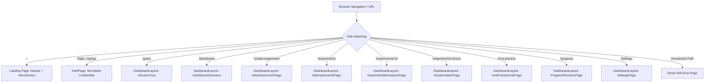

# PracPrep — Complete Project Analysis & Codebase Baseline

**Project:** PracPrep — From Lab Manual to Lab-Ready  
**Document Version:** 1.0.0  
**Date:** 2026-10-04  
**Role:** Senior Software Architect, Backend Engineer & Technical Lead  
**Scope:** Complete inspection and verification of `Hacktoberfest Challanges/Week 1`  
**Status:** Approved Architecture Baseline (Read-Only Inspection — No application source code modified)

---

## 1. Executive Overview

PracPrep is an AI-powered laboratory preparation companion designed for undergraduate engineering students. The platform bridges the gap between static laboratory manuals and practical viva-voce readiness. 

The frontend has been fully engineered and validated through seven functional development phases and an extensive UI/UX stabilization audit. It currently functions as a **client-side Single Page Application (SPA)** powered by React 19, Vite 8, TypeScript 6, and Tailwind CSS v4.

### Primary Architectural Finding
**There is currently zero backend connectivity in the codebase.**
- Every user interaction, entity persistence, authentication check, viva simulation, and progress metric is computed and stored entirely within the client's browser environment using `localStorage`.
- There are no active `fetch`, `axios`, or WebSocket calls anywhere in the source code.
- No backend code, database connections, API configurations, or environment variable definitions (`.env`) currently exist in the repository.
- Authentication in `src/pages/AuthPage.tsx` simulates network latency using a 1000ms `setTimeout` and writes an unverified user payload directly into browser storage.
- Document uploading in `src/components/experiment/LabManualUploader.tsx` captures file metadata in local component state but performs no document parsing or data extraction.
- The Viva Simulator relies on `DemonstrationVivaProvider` in `src/services/vivaAIProvider.ts`, an in-memory keyword-matching heuristic engine that satisfies the `IVivaAIProvider` contract without contacting external LLM APIs.

The frontend is architecturally well-modularized: data operations are cleanly separated behind service abstractions (`experimentStorage.ts`, `vivaStorage.ts`, `settingsStorage.ts`). This design enables a smooth transition to a Python FastAPI backend without requiring visual redesigns or component refactoring.

---

## 2. Workspace Root & Technology Stack Verification

### 2.1 Workspace Root
- **Absolute Path:** `/Users/bhavyakumar/Documents/Projects/Hacktoberfest Challanges/Week 1`
- **Source Root:** `/Users/bhavyakumar/Documents/Projects/Hacktoberfest Challanges/Week 1/src`
- **Documentation Directory:** `/Users/bhavyakumar/Documents/Projects/Hacktoberfest Challanges/Week 1/docs/architecture`

### 2.2 Verified Dependency & Tooling Inventory
Verified directly from `/package.json`, `/vite.config.ts`, `/tsconfig.json`, and `/components.json`:

| Layer | Technology | Version | Purpose & Notes |
|---|---|---|---|
| **Runtime & Framework** | React | `^19.2.8` | Client component tree and rendering |
| **DOM Engine** | React DOM | `^19.2.8` | DOM reconciliation |
| **Build & Bundler** | Vite | `^8.3.0` | Development server and production bundler |
| **Language** | TypeScript | `^6.0.2` | Static typing across components, models, and services |
| **CSS Framework** | Tailwind CSS | `^4.3.3` | Utility-first styling via `@tailwindcss/vite` |
| **Animation (GSAP)** | GSAP | `^3.15.0` | High-performance canvas animations in Hero section |
| **Animation (Motion)** | Framer Motion | `^14.0.0` | Interactive transitions, auth modal, 404 ghost |
| **Icons** | Lucide React | `^1.50.0` | Cohesive icon library across all 8 modules |
| **Class Utilities** | `clsx` + `tailwind-merge` | `2.1.1` / `3.7.0` | Dynamic CSS class merging via `cn()` |
| **Linter** | Oxlint | `^1.81.0` | Fast static analysis |
| **UI Component System** | shadcn/ui | New York / Neutral | Configuration in `components.json` |

### 2.3 Verified Directory Tree
```
Week 1/
├── index.html                           # SPA entry HTML
├── vite.config.ts                       # Vite 8 config with Tailwind v4 & '@' alias
├── tsconfig.json                        # Root TypeScript project reference
├── tsconfig.app.json                    # Application TypeScript configuration
├── tsconfig.node.json                   # Node tooling TypeScript configuration
├── package.json                         # Project metadata and dependencies
├── components.json                      # shadcn/ui configuration
├── .oxlintrc.json                       # Linter configuration
├── test-progressAnalytics.mjs           # Standalone verification script for analytics
├── test-settingsStorage.mjs             # Standalone verification script for settings
├── test-integration.mjs                 # Cross-module integration verification script
├── public/                              # Static public assets (icons, sprites, ghost-404)
├── docs/                                # Documentation and architecture specs
│   ├── frontend-architecture-audit.md   # Prior frontend architecture audit
│   └── architecture/                    # Target architecture specifications
└── src/
    ├── main.tsx                         # React entrypoint wrapped in ErrorBoundary
    ├── App.tsx                          # Manual History API client-side router
    ├── index.css                        # Global CSS, Tailwind v4 imports, theme variables
    ├── config/site.ts                   # Site constants and route paths
    ├── lib/utils.ts                     # cn() class merge helper
    ├── types/                           # Complete domain TypeScript type definitions
    ├── services/                        # Storage abstraction and AI provider contracts
    ├── utils/                           # Pure computation algorithms (analytics)
    ├── pages/AuthPage.tsx               # Sign-in and sign-up page (simulated)
    └── components/                      # Modular UI component hierarchy
        ├── BrandLogo.tsx                # SVG logo component
        ├── ErrorBoundary.tsx            # Global crash recovery boundary
        ├── HeroSection.tsx              # Landing page hero with CrowdCanvas
        ├── Navbar.tsx                   # Public navigation header
        ├── RoutePlaceholder.tsx         # Generic placeholder component
        ├── dashboard/                   # Dashboard shell, header, sidebar, widgets (11 files)
        ├── experiment/                  # New experiment creation flow (7 files)
        ├── experiments/                 # My experiments list, tables, modals (9 files)
        ├── workspace/                   # Experiment workspace & tabs (9 files)
        ├── viva/                        # Viva simulator session lifecycle (6 files)
        ├── progress/                    # Progress & revision analytics UI (9 files)
        ├── settings/                    # Settings tabs and user preferences (7 files)
        └── ui/                          # Shared UI atoms and animations (7 files)
```

---

## 3. Comprehensive File-by-File Inventory & Responsibilities

The codebase comprises **71 functional TypeScript/TSX source files** in `src/`. Below is the complete catalog grouped by architectural module.

### 3.1 Core Application Shell & Routing
| File | Lines | Responsibility | Current Storage / Backend Dependency |
|---|---|---|---|
| `src/main.tsx` | 27 | App root; mounts React 19 tree inside `ErrorBoundary` | None |
| `src/App.tsx` | 247 | Manual History API router handling paths `/`, `/login`, `/signup`, `/guest`, `/dashboard`, `/create-experiment`, `/experiments`, `/experiments/:id`, `/experiments/:id/viva`, `/viva-practice`, `/progress`, `/settings` | None. Reads `window.location.pathname` and listens to `popstate` events |
| `src/config/site.ts` | 32 | Global branding strings and route path constants | None |
| `src/lib/utils.ts` | 6 | `cn()` utility combining `clsx` and `tailwind-merge` | None |
| `src/index.css` | 148 | Tailwind CSS v4 directives, font declarations, dark mode variables, reduced-motion overrides | None |

### 3.2 Domain Data Contracts (`src/types/`)
| File | Key Interfaces & Types | Domain Representation |
|---|---|---|
| `src/types/dashboard.ts` | `UserSession`, `NavItem`, `ExperimentSummary`, `SnapshotMetric`, `ActivityItem` | Authenticated user state, shell navigation, and high-level dashboard summaries |
| `src/types/experiment.ts` | `ExperimentRecord`, `ExperimentFormData`, `ExperimentStatus`, `ChecklistItem`, `PREPARATION_CHECKLIST_ITEMS` | Experiment core entity, creation form inputs, lifecycle states, and preparation checklist items |
| `src/types/viva.ts` | `VivaQuestion`, `VivaEvaluation`, `VivaAnswerRecord`, `VivaSessionRecord`, `VivaSessionConfig`, `TopicPerformance`, `RevisionRecommendation` | Viva question structure, answer evaluation rubric, viva session records, and topic analytics |
| `src/types/progress.ts` | `ProgressOverviewMetrics`, `ExperimentReadinessItem`, `PerformanceTrendPoint`, `TopicAggregatedPerformance`, `RevisionPriorityItem`, `StrongTopicItem`, `RecommendedNextStep` | Analytical outputs computed over experiments and viva sessions |
| `src/types/settings.ts` | `UserSettings`, `ThemePreference`, `DensityPreference`, `StudyPreferences`, `ExportDataPayload` | User display preferences, default viva configurations, and complete data export schema |

### 3.3 Persistence Services & AI Provider (`src/services/`)
| File | Primary Functions / Methods | Storage Mechanism | Integration Strategy |
|---|---|---|---|
| `src/services/experimentStorage.ts` | `getExperiments()`, `getExperimentById()`, `saveExperiment()`, `updateExperiment()`, `deleteExperiment()`, `toggleChecklistItem()`, `subscribe()` | `localStorage` with keys `pracprep_experiments_guest` and `pracprep_experiments_user_{email}`. Dispatches `pracprep_experiments_changed`. | Replace CRUD operations with `/api/v1/experiments` REST client calls; maintain synchronous guest fallback. |
| `src/services/vivaStorage.ts` | `getSessions()`, `getSessionsByExperiment()`, `saveSession()`, `deleteSession()`, `clearSessions()`, `subscribe()` | `localStorage` with keys `pracprep_viva_sessions_guest` and `pracprep_viva_sessions_user_{email}`. Dispatches `pracprep_viva_sessions_changed`. | Replace CRUD operations with `/api/v1/viva/sessions` REST client calls. |
| `src/services/settingsStorage.ts` | `getSettings()`, `saveSettings()`, `updateUserProfile()`, `applyTheme()`, `exportUserData()`, `clearAllUserData()` | `localStorage` keys `pracprep_settings_*` and `pracprep_user`. Dispatches `pracprep_settings_changed` and `pracprep_user_changed`. | Split responsibilities: UI preferences stay local; profile and study preferences synchronize with `/api/v1/users/me`. |
| `src/services/vivaAIProvider.ts` | `generateQuestions()`, `evaluateAnswer()`, `analyzeSession()` via `DemonstrationVivaProvider` implementing `IVivaAIProvider` | In-memory keyword matching and template synthesis. Simulated async delay (`setTimeout` 350-400ms). | Implement `RemoteAIVivaProvider` calling `/api/v1/viva/generate` and `/api/v1/viva/evaluate` while retaining demo provider as offline fallback. |

### 3.4 Analytical Utilities (`src/utils/`)
| File | Key Functions | Characteristics |
|---|---|---|
| `src/utils/progressAnalytics.ts` | `calculateOverviewMetrics()`, `calculateExperimentReadiness()`, `extractPerformanceTrendPoints()`, `aggregateTopicPerformance()`, `extractRevisionPriorities()`, `extractStrongTopics()`, `generateRecommendedNextSteps()` | Pure, deterministic client-side calculation functions. Consumes raw arrays of `ExperimentRecord` and `VivaSessionRecord`. Kept frontend-only initially. |

### 3.5 Authentication (`src/pages/AuthPage.tsx`)
- **Structure:** 943 lines implementing sign-in and sign-up with email/password validation, tab toggling, visual layout, and test credential autofill (`demo@pracprep.edu`).
- **Simulated Behavior:**
  ```ts
  // Simulated authentication request in AuthPage.tsx
  setTimeout(() => {
    const userSession: UserSession = {
      isGuest: false,
      name: isSignUp ? name : 'Alex Morgan',
      email: email,
      university: 'Apex Institute of Technology',
    };
    localStorage.setItem('pracprep_user', JSON.stringify(userSession));
    window.location.href = '/dashboard';
  }, 1000);
  ```
- **Social Auth & Password Reset:** Google OAuth and "Forgot password" handlers invoke `alert()` stubs.

### 3.6 Dashboard Module (`src/components/dashboard/`)
- `DashboardLayout.tsx`: Shell wrapper for authenticated views. Reads `localStorage.getItem('pracprep_user')` inside a `useMemo`. Manages sidebar collapse, mobile drawer, and global experiment subscription.
- `DashboardHeader.tsx`: Top bar containing route breadcrumb, ⌘K search trigger, theme indicator, and user profile avatar.
- `DashboardSidebar.tsx`: Navigation bar linking to Overview, New Experiment, My Experiments, Viva Practice, Progress, and Settings.
- `DashboardOverview.tsx`: Root dashboard dashboard view assembling welcome banner, quick action cards, metrics snapshot, and recent experiment listings.
- `WelcomeSection.tsx`: Contextual greeting with preparation readiness score.
- `PrimaryActionCard.tsx`: Highlights primary call-to-action ("New Experiment" or "Start Viva").
- `QuickAccess.tsx`: Direct shortcuts to key functional sub-areas.
- `PreparationSnapshot.tsx`: Renders 4 high-level preparation cards (Readiness, Total Experiments, Viva Sessions, Weak Topics).
- `RecentExperiments.tsx`: Renders the 3 most recently updated experiment records.
- `SearchDialog.tsx`: Modal search interface filtering experiments by title and subject.
- `DashboardModulePlaceholder.tsx`: Fallback view for sub-modules.

### 3.7 New Experiment Creation Module (`src/components/experiment/`)
- `NewExperimentPage.tsx`: Container orchestrating the multi-method experiment creation flow.
- `CreationMethodSelector.tsx`: Allows students to choose between "Upload Lab Manual" and "Manual Entry".
- `LabManualUploader.tsx`: Drag-and-drop zone accepting `.pdf`, `.docx`, and images. **File is captured in React state but never uploaded or parsed.**
- `ManualExperimentForm.tsx`: Comprehensive form collecting Title, Subject, Experiment Number, Semester, Objective, Theory, Apparatus, Procedure, Precautions, Observations, and Calculations.
- `ExperimentDetailsForm.tsx`: Core metadata form fields.
- `PreparationPreview.tsx`: Summary preview card shown prior to final record creation.
- `ExperimentFormActions.tsx`: Action toolbar for form submission and cancellation.

### 3.8 My Experiments Module (`src/components/experiments/`)
- `MyExperimentsPage.tsx`: Master repository view with live search, subject filtering, status filtering, and sorting.
- `ExperimentToolbar.tsx`: Search input, status chips, subject dropdown, and view switcher (Table vs Grid).
- `ExperimentTable.tsx`: Tabular layout with title, subject, status, viva count, readiness, and action menus.
- `ExperimentCardsList.tsx`: Responsive card grid view of experiments.
- `ExperimentSummaryRow.tsx`: Aggregate statistics bar (total, completed, in-progress, draft).
- `ExperimentStatusBadge.tsx`: Visual badge for experiment states (`draft`, `in-progress`, `completed`, `ready`, `analyzing`).
- `ExperimentEmptyState.tsx`: Empty state placeholder prompting manual or upload creation.
- `EditExperimentModal.tsx`: Dialog permitting in-place updates to experiment metadata and structured content.
- `DeleteExperimentModal.tsx`: Destructive confirmation dialog with cascading deletion warning.

### 3.9 Experiment Workspace Module (`src/components/workspace/`)
- `ExperimentWorkspacePage.tsx`: Detailed multi-tab study hub for a specific experiment identified by URL parameter `id`.
- `ExperimentWorkspaceHeader.tsx`: Displays subject, title, status badge, readiness score, and quick launch button for viva simulator.
- `WorkspaceOverviewTab.tsx`: Summary of experiment objective, syllabus mapping, and quick stats.
- `WorkspaceTheoryTab.tsx`: Rendered theoretical concepts, formulas, and working principles.
- `WorkspaceApparatusTab.tsx`: Required apparatus, instruments, and equipment lists.
- `WorkspaceProcedureTab.tsx`: Step-by-step experimental procedure.
- `WorkspaceObservationsTab.tsx`: Observation tables, formulas, and calculation steps.
- `WorkspacePrecautionsTab.tsx`: Safety rules and procedural precautions.
- `WorkspaceChecklistTab.tsx`: Interactive preparation checklist (6 default items) with instant toggle persistence.

### 3.10 Viva Simulator Module (`src/components/viva/`)
- `VivaSimulatorPage.tsx`: Lifecycle orchestrator for active viva examinations (`setup` -> `active` -> `results` -> `review`).
- `VivaPracticeHubPage.tsx`: Central hub listing all experiments eligible for viva simulation alongside past session records.
- `VivaSetupScreen.tsx`: Pre-session configuration (difficulty level, question count [5, 10, 15], topic focus).
- `VivaActiveSession.tsx`: Interactive questioning screen with question card, answer textarea, progress bar, instant submission, and live feedback evaluation.
- `VivaResultsScreen.tsx`: Post-session summary with overall score, readiness rating, topic mastery breakdown, and action items.
- `VivaReviewAnswers.tsx`: Detailed question-by-question review displaying student response, model answer, key points matched, and evaluator rationale.

### 3.11 Progress & Revision Center Module (`src/components/progress/`)
- `ProgressRevisionPage.tsx`: Central dashboard orchestrating analytics over all experiments and completed viva sessions.
- `ProgressOverviewCards.tsx`: 4 high-level KPI cards (Average Viva Score, Exam Readiness, Revision Topics, Completed Experiments).
- `PerformanceTrendChart.tsx`: Custom SVG timeline chart tracking viva performance over time (All, 30d, 7d).
- `ExperimentReadinessList.tsx`: Prioritized list of experiments with color-coded preparation bars.
- `TopicMasteryBreakdown.tsx`: Progress bars illustrating mastery across Theory, Apparatus, Procedure, Observations, and Precautions.
- `RevisionPrioritySection.tsx`: Highlighted topics scoring below 60% with recommended remedial actions.
- `StrongTopicsSection.tsx`: Celebrates areas of high proficiency (>80%).
- `RecommendedNextSteps.tsx`: Actionable recommendations generated dynamically based on weak areas.
- `SessionHistoryTable.tsx`: Full historical ledger of past viva attempts with score, date, and review triggers.

### 3.12 Settings & Personalization Module (`src/components/settings/`)
- `SettingsPage.tsx`: Tabbed settings container (Profile, Appearance, Study Preferences, Data & Privacy, About).
- `ProfileSettingsSection.tsx`: Student name, email, and university editing.
- `AppearanceSettingsSection.tsx`: Light, Dark, and System theme selector; Comfortable vs Compact density; Reduced motion toggle.
- `StudyPreferencesSection.tsx`: Default difficulty, default viva question count, and preferred topic focus.
- `DataPrivacySection.tsx`: Data export (generates downloadable JSON blob) and "Clear All Data" wipe button.
- `AccountActionsSection.tsx`: Sign out and Account Deletion triggers.
- `AboutSettingsSection.tsx`: Application version, platform details, and Hacktoberfest credits.

### 3.13 UI Primitives (`src/components/ui/`)
- `ghost-404-page.tsx`: Framer Motion 404 error page.
- `skiper39.tsx`: CrowdCanvas GSAP dynamic particle animation for the landing page hero.
- `auth-switch.tsx`: Animated toggle between Sign In and Sign Up modes.
- `flow-button.tsx`: Interactive gradient action button.
- `demo-auth.tsx`, `demo.tsx`, `ghost-404-demo.tsx`: Component showcase harnesses.

---

## 4. Page Routing & Feature Behavior

The application utilizes a manual routing implementation in `src/App.tsx` that intercepts navigation, maintains browser history via `window.history.pushState`, and listens to `popstate` events.



### Route Behavior & Access Matrix

| Route Path | View Component | Auth Requirement | Current Storage Read/Write |
|---|---|---|---|
| `/` | `Navbar` + `HeroSection` | None (Public) | None |
| `/login`, `/signup` | `AuthPage` | None (Public) | Writes `pracprep_user` on submit |
| `/guest` | `DashboardLayout` | None (Public) | Sets `isGuest: true`, reads `_guest` storage keys |
| `/dashboard` | `DashboardOverview` | None (Unprotected) | Reads `pracprep_experiments_*` |
| `/create-experiment` | `NewExperimentPage` | None (Unprotected) | Writes `pracprep_experiments_*` |
| `/experiments` | `MyExperimentsPage` | None (Unprotected) | Reads/Writes `pracprep_experiments_*` |
| `/experiments/:id` | `ExperimentWorkspacePage` | None (Unprotected) | Reads/Writes `pracprep_experiments_*` |
| `/experiments/:id/viva` | `VivaSimulatorPage` | None (Unprotected) | Reads experiments; writes `pracprep_viva_sessions_*` |
| `/viva-practice` | `VivaPracticeHubPage` | None (Unprotected) | Reads experiments and viva sessions |
| `/progress` | `ProgressRevisionPage` | None (Unprotected) | Reads experiments and viva sessions |
| `/settings` | `SettingsPage` | None (Unprotected) | Reads/Writes `pracprep_settings_*` and `pracprep_user` |
| `/*` (404) | `Ghost404Page` | None (Public) | None |

---

## 5. Data Flow & Current Persistence Mechanisms

### 5.1 Storage Partitioning Strategy
Storage in `src/services/` is partitioned using an email-derived prefix for authenticated sessions, falling back to a `_guest` suffix:

```ts
// Storage partition key derivation in experimentStorage.ts
function getStorageKey(user?: UserSession | null): string {
  if (!user || user.isGuest) {
    return 'pracprep_experiments_guest';
  }
  const safeEmail = (user.email || 'user').toLowerCase().replace(/[^a-z0-9]/g, '_');
  return `pracprep_experiments_user_${safeEmail}`;
}
```

### 5.2 Complete Verified localStorage Key Inventory

| Storage Key Pattern | Value Type | Scope | Written By | Read By |
|---|---|---|---|---|
| `pracprep_user` | `UserSession` (JSON) | Global | `AuthPage.tsx`, `settingsStorage.ts` | `DashboardLayout.tsx`, `settingsStorage.ts` |
| `pracprep_experiments_guest` | `ExperimentRecord[]` | Guest | `experimentStorage.ts` | `experimentStorage.ts` |
| `pracprep_experiments_user_{email}` | `ExperimentRecord[]` | Per-User | `experimentStorage.ts` | `experimentStorage.ts` |
| `pracprep_experiments` | `ExperimentRecord[]` | Legacy | `experimentStorage.ts` | `experimentStorage.ts` (fallback) |
| `pracprep_viva_sessions_guest` | `VivaSessionRecord[]` | Guest | `vivaStorage.ts` | `vivaStorage.ts` |
| `pracprep_viva_sessions_user_{email}` | `VivaSessionRecord[]` | Per-User | `vivaStorage.ts` | `vivaStorage.ts` |
| `pracprep_settings_guest` | `UserSettings` | Guest | `settingsStorage.ts` | `settingsStorage.ts` |
| `pracprep_settings_user_{email}` | `UserSettings` | Per-User | `settingsStorage.ts` | `settingsStorage.ts` |

### 5.3 Custom Event Bus Synchronization
To simulate reactive state updates across isolated components without a global state manager (such as Redux or Zustand), the services emit synthetic `CustomEvent` instances on `window`:

- `pracprep_experiments_changed`: Fired by `experimentStorage.ts` whenever an experiment is created, updated, deleted, or toggled. `DashboardLayout.tsx` listens to this event to trigger a re-fetch.
- `pracprep_viva_sessions_changed`: Fired by `vivaStorage.ts` on session creation or deletion.
- `pracprep_settings_changed`: Fired by `settingsStorage.ts` on preference changes.
- `pracprep_user_changed`: Fired by `settingsStorage.ts` when the user edits profile attributes.
- Native `storage` event: Listened to by all service subscribers to handle multi-tab synchronization.

---

## 6. Frontend Data Models & Type Contracts

The TypeScript domain models defined under `src/types/` define the functional contract that the backend API must satisfy.

### 6.1 `ExperimentRecord` (`src/types/experiment.ts`)
```ts
export type ExperimentStatus = 'draft' | 'in-progress' | 'completed' | 'ready' | 'analyzing';

export interface ExperimentRecord {
  id: string;                         // Currently generated as `exp-${Date.now()}`
  title: string;
  subject: string;
  experimentNumber?: string;
  courseSemester?: string;
  method?: 'upload' | 'manual';
  hasManualFile?: boolean;
  fileName?: string;                  // Uploaded manual filename
  createdAt: string;                  // Human-readable date string
  createdAtTimestamp: number;         // Unix millisecond timestamp
  updatedAt: string;                  // Human-readable date string
  updatedAtTimestamp: number;         // Unix millisecond timestamp
  status: ExperimentStatus;
  vivaQuestionsCount: number;
  description?: string;
  objective?: string;
  theory?: string;
  apparatus?: string;
  procedure?: string;
  observations?: string;
  calculations?: string;
  precautions?: string;
  preparationChecklist?: Record<string, boolean>; // Keyed by checklist item ID
}
```

### 6.2 `VivaSessionRecord` (`src/types/viva.ts`)
```ts
export type VivaDifficulty = 'easy' | 'medium' | 'hard';
export type VivaTopic = 'theory' | 'apparatus' | 'procedure' | 'observations' | 'precautions' | 'all';

export interface VivaQuestion {
  id: string;
  topic: VivaTopic;
  difficulty: VivaDifficulty;
  question: string;
  expectedAnswer: string;
  keyPoints: string[];
}

export interface VivaEvaluation {
  score: number;                      // 0 to 10
  feedback: string;
  keyPointsCovered: string[];
  keyPointsMissed: string[];
  suggestedImprovement: string;
}

export interface VivaAnswerRecord {
  questionId: string;
  questionText: string;
  topic: VivaTopic;
  difficulty: VivaDifficulty;
  studentAnswer: string;
  evaluation: VivaEvaluation;
  timeSpentSeconds: number;
}

export interface VivaSessionRecord {
  id: string;                         // Generated as `viva-${Date.now()}`
  experimentId: string;
  experimentTitle: string;
  config: {
    difficulty: VivaDifficulty;
    questionCount: number;
    topicFocus: VivaTopic;
  };
  startedAt: number;
  completedAt?: number;
  isCompleted: boolean;
  answers: VivaAnswerRecord[];
  averageScore: number;
  weakTopics: string[];
  strongTopics: string[];
  revisionRecommendations: Array<{
    topic: string;
    reason: string;
    recommendedAction: string;
  }>;
  providerMode: 'demonstration' | 'ai-live';
}
```

### 6.3 `UserSettings` (`src/types/settings.ts`)
```ts
export type ThemePreference = 'light' | 'dark' | 'system';
export type DensityPreference = 'comfortable' | 'compact';

export interface StudyPreferences {
  defaultDifficulty: VivaDifficulty;
  defaultQuestionCount: 5 | 10 | 15;
  preferredFocus: VivaTopic;
}

export interface UserSettings {
  theme: ThemePreference;
  density: DensityPreference;
  reducedMotion: boolean;
  studyPreferences: StudyPreferences;
}
```

---

## 7. Current Mock & Demonstration Implementations

### 7.1 Simulated Authentication (`src/pages/AuthPage.tsx`)
- Form submissions simulate an API handshake via `setTimeout(..., 1000)`.
- No password hashing, credential verification, or JWT generation takes place.
- Any email and password combination is treated as valid.
- Google OAuth and Forgot Password buttons trigger browser `alert()` dialogs.

### 7.2 Demonstration Viva AI Engine (`src/services/vivaAIProvider.ts`)
- Implements `IVivaAIProvider` using `DemonstrationVivaProvider`.
- **Question Generation:** Selects from pre-configured template questions customized with the experiment's title and subject.
- **Answer Evaluation:** Computes an answer score based on a deterministic keyword-matching heuristic:
  ```ts
  // Heuristic calculation from vivaAIProvider.ts
  const studentLower = studentAnswer.toLowerCase().trim();
  const covered = question.keyPoints.filter(kp =>
    studentLower.includes(kp.toLowerCase())
  );
  const ratio = covered.length / question.keyPoints.length;
  const lengthBonus = studentLower.length > 50 ? 1 : 0;
  const score = Math.min(10, Math.max(2, Math.round(ratio * 8 + lengthBonus)));
  ```
- No external LLM endpoint is queried.

### 7.3 Lab Manual File Upload (`src/components/experiment/LabManualUploader.tsx`)
- Students can drop or select a `.pdf` or `.docx` manual file.
- The component saves the `File` reference in local state and passes `hasManualFile: true` and `fileName: file.name` to the experiment creation handler.
- **No file upload, binary reading, OCR, or text extraction occurs.** Created experiments have empty theory, procedure, and apparatus sections.

---

## 8. Verification of Backend Connectivity

A thorough static search across all TypeScript and TSX files in `src/` yielded the following findings:

```bash
grep -rnE "fetch\(|axios|XMLHttpRequest|WebSocket|EventSource|VITE_|import\.meta\.env" src/
```
**Results:**
- `fetch(`: 0 occurrences
- `axios`: 0 occurrences (not listed in `package.json`)
- `XMLHttpRequest`: 0 occurrences
- `WebSocket` / `EventSource`: 0 occurrences
- `import.meta.env` / `VITE_*`: 0 occurrences
- Network calls found: 0

The application is completely self-contained within the browser runtime.

---

## 9. Architectural Risks, Limitations & Integration Hazards

1. **Absence of Route Guards:** All dashboard, experiment, and settings routes can be accessed directly without an active session. A user entering `/dashboard` in a fresh incognito window sees an empty state or fallback username without being redirected to `/login`.
2. **Identifier Generation Vulnerabilities:** Existing IDs (`exp-${Date.now()}` and `viva-${Date.now()}`) rely on client timestamps. Concurrent writes or rapid automated tests will produce collisions. The backend must enforce server-generated UUID v4 values.
3. **Partition Key Mutation Risk:** Scoping data using `pracprep_experiments_user_{safeEmail}` means that if a user's email address is modified, all existing experiment and viva data becomes orphaned and inaccessible. Backend integration must use a permanent `user_id` as the relational foreign key.
4. **Browser LocalStorage Quota Exceeded:** Detailed experiment text, calculation logs, and multi-question viva session transcripts with complete evaluation records easily exceed the 5MB browser `localStorage` quota over semester-long usage.
5. **Divergent Viva Subscriber Pattern:** While `experimentStorage.ts` successfully triggers global re-renders via `pracprep_experiments_changed`, `VivaPracticeHubPage` does not subscribe to `pracprep_viva_sessions_changed`, causing session history tables to show stale data until a hard page reload.
6. **Unparsed File Upload Disconnect:** Users who upload a lab manual currently receive an experiment record marked "upload" with zero extracted text, creating user confusion and perceived data loss.

---

## 10. Architecture Baseline for Backend Development

Based on this comprehensive inspection, the backend architecture must provide:
1. A stateless, secure REST API under `/api/v1` built with **Python, FastAPI, Pydantic, SQLAlchemy 2.0 (async), and PostgreSQL**.
2. Robust JWT-based authentication replacing the simulated `AuthPage.tsx` handlers.
3. Relational models with UUID v4 primary keys and explicit foreign-key ownership mapping to `ExperimentRecord` and `VivaSessionRecord`.
4. A pluggable AI provider adapter (`BaseAIProvider`) that proxies LLM question generation and rubric-based answer evaluation on the server while preserving a deterministic fallback.
5. A staged document extraction pipeline (PDF/DOCX extraction + OCR fallback + LLM structuring) to fulfill the promise of `LabManualUploader.tsx`.
6. Transparent frontend API adapters replacing the `localStorage` methods while preserving the existing UI components and user workflows.
